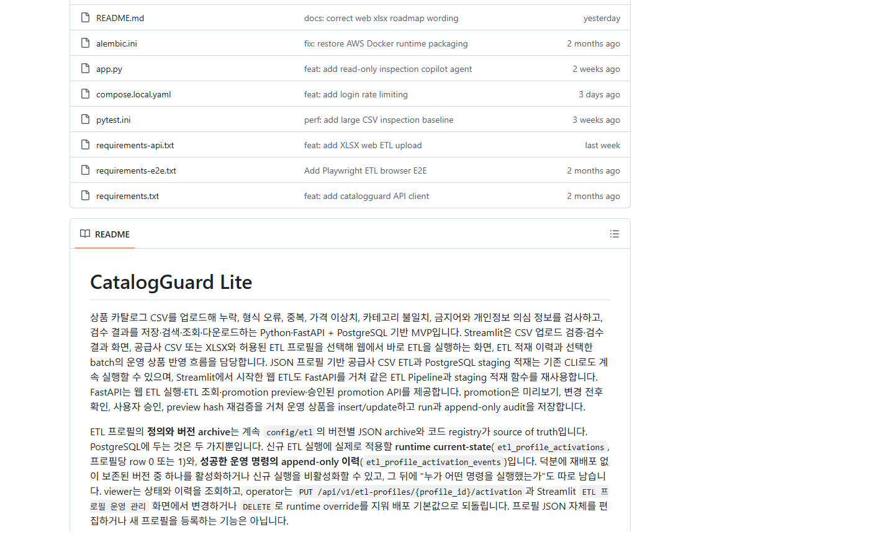
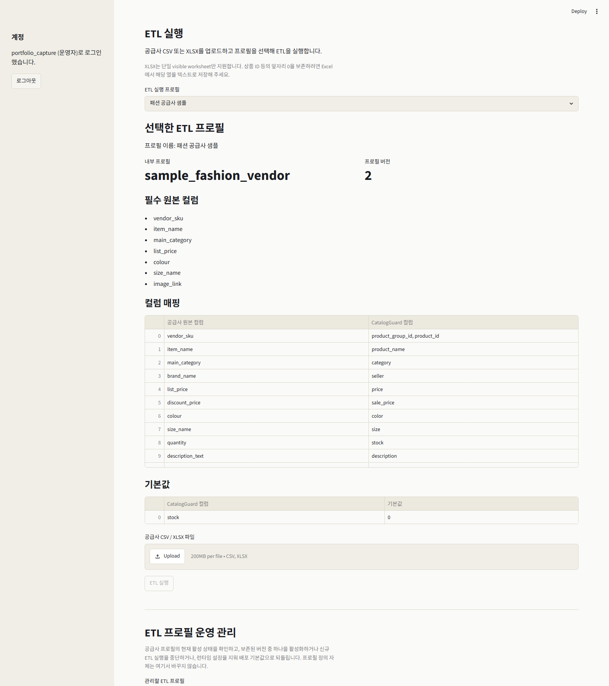
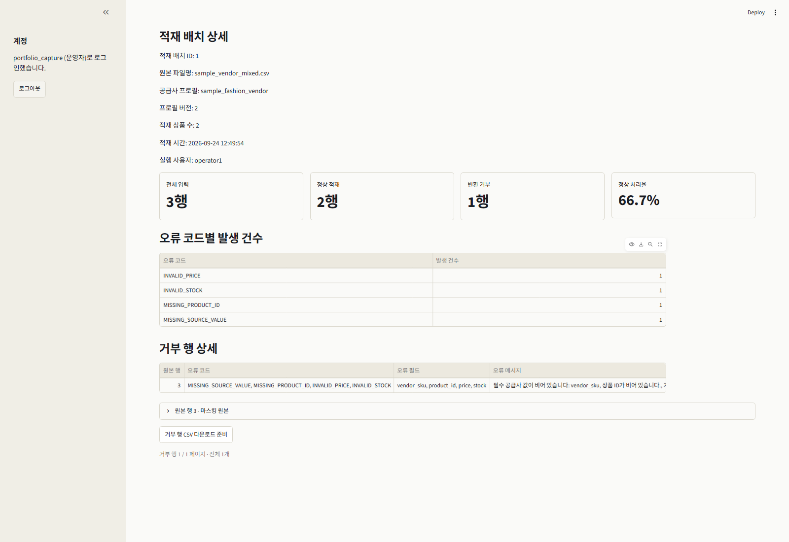
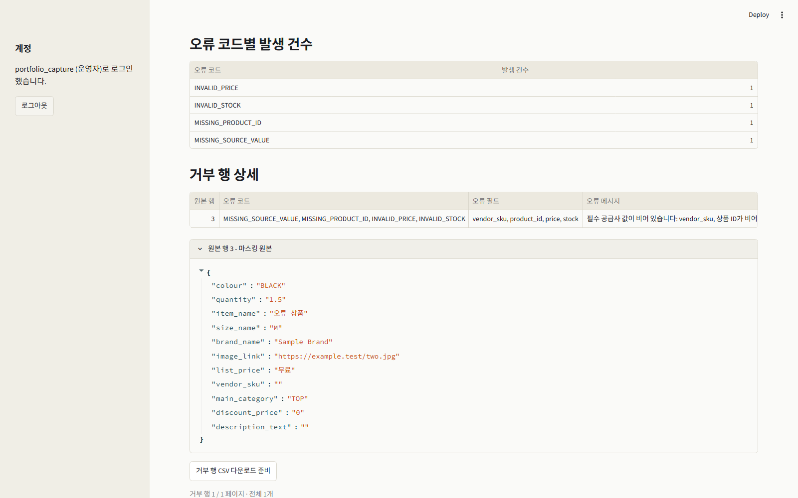
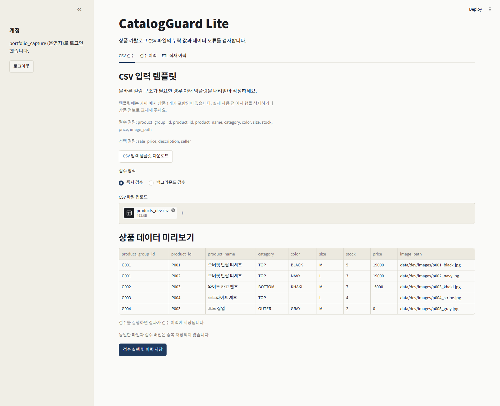
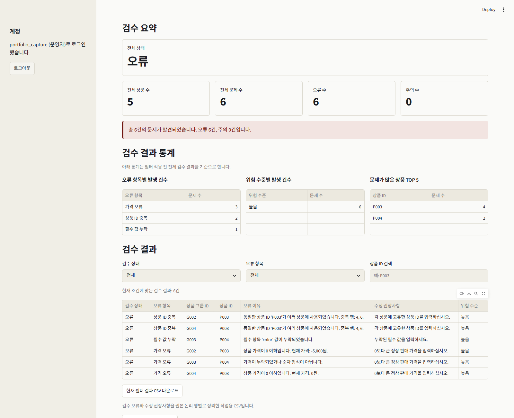
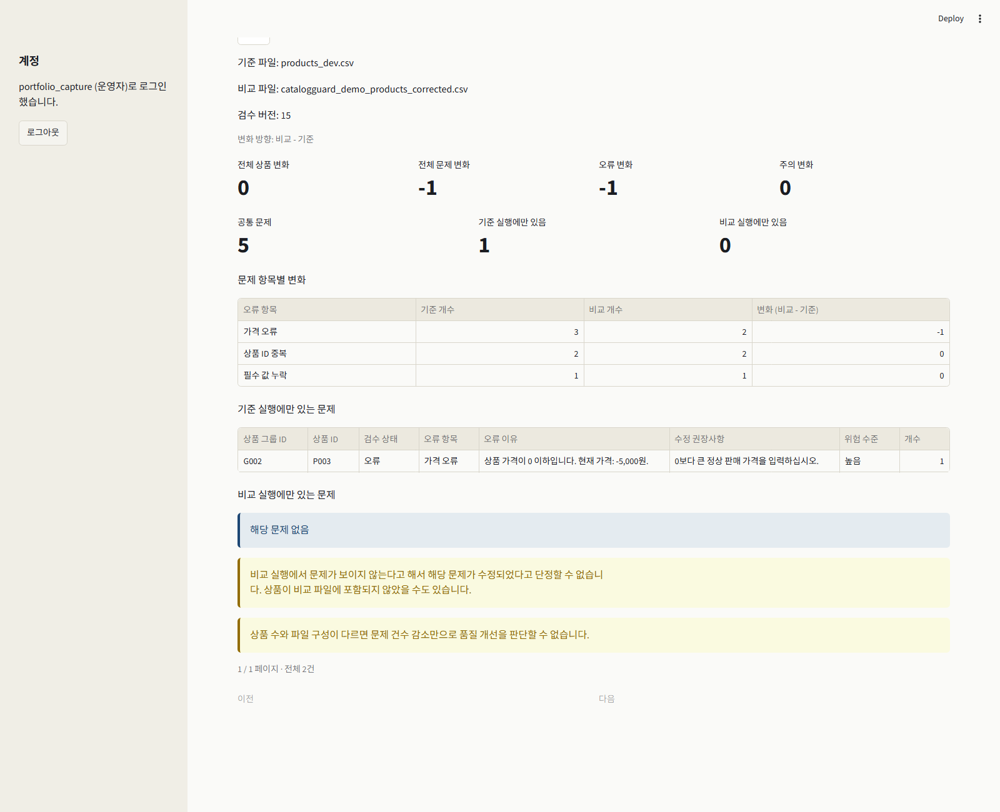
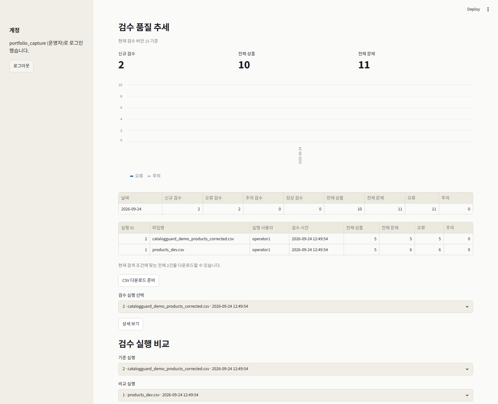
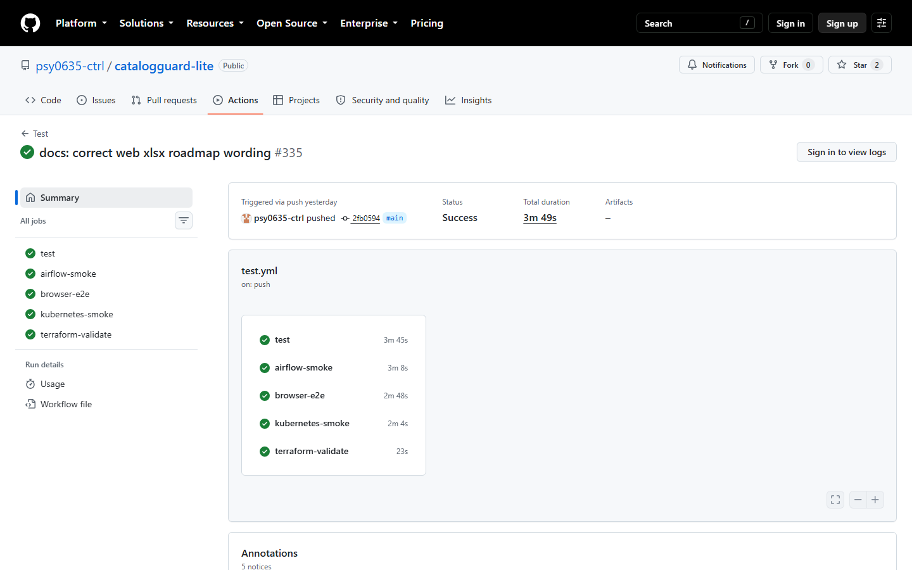

# CatalogGuard Lite
### 패션·이커머스 상품 카탈로그 데이터 품질 검수 및 ETL 시스템

## 한눈에 보기

공급사마다 다른 상품 형식을 표준화하고, 등록 전 누락·가격·중복·카테고리·개인정보 의심 문제의 이유와 수정 방향을 알려주는 프로젝트입니다.

| 항목 | 내용 |
|---|---|
| 기간 | 확인 필요 |
| 프로젝트 형태 | 확인 필요 |
| 역할 | 확인 필요 |
| 핵심 기술 | Python 3.11, FastAPI, Streamlit, PostgreSQL, SQLAlchemy, Alembic, Pytest |
| Repository | [psy0635-ctrl/catalogguard-lite](https://github.com/psy0635-ctrl/catalogguard-lite) |
| 상태 | Feature Freeze / Maintenance Mode. 데모·CI 근거는 `2fb0594` 기준 |

## 문제 정의

공급사별 CSV 컬럼이 다르고 필수값 누락, 가격 오류, 중복 상품, 잘못된 카테고리가 등록 뒤 발견되면 원본을 다시 추적해야 합니다. 상품 설명에 개인정보가 섞일 수도 있습니다. 목표는 **형식 표준화, reject 원인 기록, 등록 전 검수, 저장 결과의 재검수·비교**입니다.

## 해결 구조

**공급사 CSV/XLSX → 웹 ETL → 프로필 매핑 → 정상/reject → PostgreSQL staging**  
**상품 CSV → 별도 Inspection → 규칙 검사·결과 저장 → 이유·권장사항 → 원본 수정·재검수 → Comparison/Trend**

웹 ETL이 Inspection을 자동 실행하지는 않습니다. Streamlit은 화면, FastAPI는 실행·조회, PostgreSQL은 이력을 담당합니다.

## 핵심 기능

### 1. 공급사 ETL

패션 공급사 샘플 프로필 **버전 2**로 합성 CSV **3행 중 정상 2·reject 1행**을 처리했습니다. 거부 행에는 `MISSING_SOURCE_VALUE`, `MISSING_PRODUCT_ID`, `INVALID_PRICE`, `INVALID_STOCK`와 이유·마스킹 원본을 남겼습니다.

### 2. 상품 Inspection

`products_dev.csv`의 **상품 5개에서 issue 6건**을 확인했습니다. `duplicate_product_id`, `missing_required_field`, `invalid_non_positive_price`, `invalid_price`의 항목·이유·권장사항과 원본 행을 보여줍니다. Correction Worksheet는 수정 참고 자료이며 재업로드 파일은 아닙니다.

### 3. 재검수 Comparison / Trend

원본 **run 1**의 음수 가격 한 건을 수정해 **run 2**를 저장했습니다. issue는 6→5건, 원본 기준 **common 5 / base_only 1 / target_only 0**입니다. 이는 문제의 존재 위치를 구분한 결과이며 개선 여부는 동일 상품 구성과 실제 수정 내용을 확인해 해석합니다.

Trend는 모든 요청이 아니라 **Inspection Version 15로 새로 저장한 실행**을 서울 날짜로 집계합니다. 2026-09-24 데모 값은 실행 2건·상품 10개·issue 11건입니다.

## 핵심 설계

### Idempotency

ETL은 **입력 SHA-256 + 프로필 이름·버전**, Inspection은 **파일 SHA-256 + 검수 버전**으로 중복을 판단합니다. 재업로드마다 INSERT해 집계가 부푸는 일을 막기 위해 먼저 조회하고, 동시 요청은 DB unique 제약과 충돌 후 기존 결과 재조회로 처리합니다.

### Transaction

`etl/db_loader.py::load_standard_csv`는 배치·정상 staging 상품·reject를 한 트랜잭션에 저장합니다. 실패하면 전체 rollback으로 반쪽 배치를 막습니다. Inspection도 run과 상세 issue를 함께 저장합니다.

### Inspection Version

규칙의 의미가 바뀌면 같은 CSV도 새 버전으로 검수합니다. 현재 **15**이며 Comparison은 의미가 같은 버전끼리만 허용합니다.

## 품질 검증

### Golden Regression

고정 합성 fixture **39행·예상 issue 31건·활성 코드 24/24**와 현재 규칙을 비교한 제한 실행은 **2 passed**였습니다([실제 출력](demo-notes/golden-regression.txt)). 이는 회귀 검증이며 실데이터 정확도나 오탐·미탐률이 아닙니다.

### CI

`2fb0594`의 기존 Actions에서 **test**(테스트·DB), **browser-e2e**(Chromium), **kubernetes-smoke**(kind·readiness), **terraform-validate**(구성·mock), **airflow-smoke**(DAG·적재) 5개 job이 성공했습니다. production 운영 전체의 검증을 뜻하지는 않습니다.

## 기술적 문제 해결

### ETL transaction

**문제·원인:** 일부 INSERT 실패 시 배치와 정상·reject 수가 어긋날 수 있습니다. **해결:** 한 트랜잭션과 rollback, identity·unique 제약을 적용했습니다. **검증:** PostgreSQL 테스트에서 reject·상품 저장 실패 후 배치도 남지 않음을 확인했습니다.

### Async redelivery

**문제·원인:** 완료 작업의 broker 재전달은 정리된 파일 접근이나 결과 덮어쓰기를 일으킬 수 있습니다. **해결:** `workers/inspection_tasks.py::inspect_csv_task`가 `succeeded`/`failed` 상태면 파일 접근 전에 종료합니다. **검증:** 재전달 테스트에서 기존 상태·결과가 유지됐습니다.

### XLSX validation

**문제·원인:** XLSX는 ZIP/XML이므로 확장자만으로는 압축 폭증·매크로·외부 링크를 막지 못합니다. **해결:** ZIP 구조·크기·압축률·XML·행/열·단일 visible worksheet를 검사한 후 기존 ETL pipeline을 재사용합니다. **검증:** 정상·거부 입력의 API/파서 테스트를 확인했습니다. XLSX는 **웹 ETL만** 지원하며 CLI·S3·HTTP feed·Airflow는 CSV만 받습니다.

## 사용 기술

- **Backend/UI:** Python 3.11·FastAPI 실행/권한 API, Streamlit 업로드·이력 화면.
- **Data/DB:** PostgreSQL 저장, SQLAlchemy 트랜잭션, Alembic 스키마 관리.
- **Test/운영 보조:** Pytest·Playwright E2E; Redis·Celery 비동기 검수; Airflow, Docker, kind, Terraform mock, GitHub Actions로 각 경로 검증.
- **안정성:** JWT 요청마다 사용자 role·활성 상태를 DB에서 재확인합니다. Redis username/IP fixed window는 Lua로 원자 처리하고 한도 초과 시 429, Redis 장애 시 fail-open metric을 기록합니다. 선택형 OpenAI/Ollama Copilot은 저장 결과를 읽기 전용으로 설명합니다.

## 프로젝트 한계

XLSX는 모든 입력 경로에 제공되지 않습니다. 실제 대규모 production 사용자 데이터의 규칙 품질 측정은 제한적이고 개인정보 규칙에는 오탐·미탐 가능성이 있습니다. 운영 metric 수집·대시보드·알림은 없고 Streamlit 경유 IP bucket은 공유 주소가 될 수 있습니다. Copilot 설명도 자동 정답이 아닙니다. 실제 데이터와 병목이 확보되면 품질·성능을 측정하고, 운영 도입 시 metric 수집·알림을 연결할 계획입니다.

## 배운 점

- 데이터 처리에서는 정상 경로보다 **실패·중복·재실행**에서 일관성이 깨지기 쉽습니다.
- 새 규칙만큼 기존 규칙의 의미를 Golden fixture로 지키는 일이 중요합니다.
- API 응답, DB의 원자적 저장, 화면에서 설명 가능한 결과를 각각 검증해야 합니다.

> 데모·Golden·CI는 `2fb0594` 기준 `main`의 근거입니다. 공식 Release `v0.3.0`에 이후 미출시 `main` 기능을 소급하지 않습니다.

