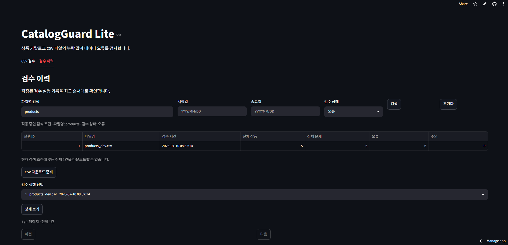
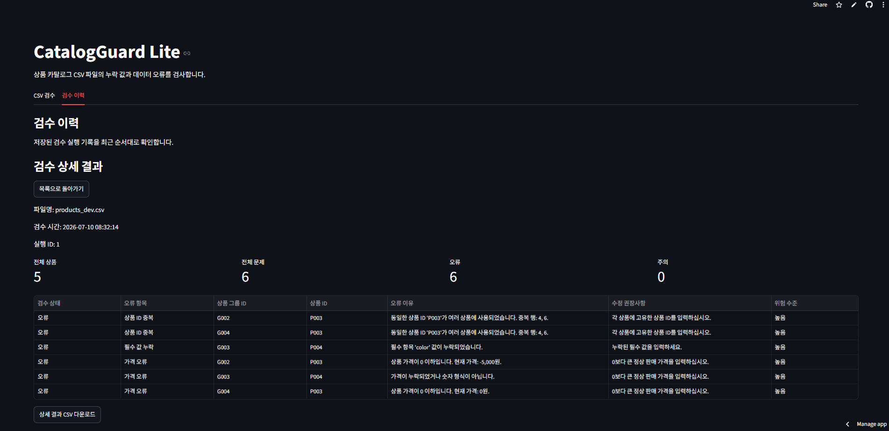
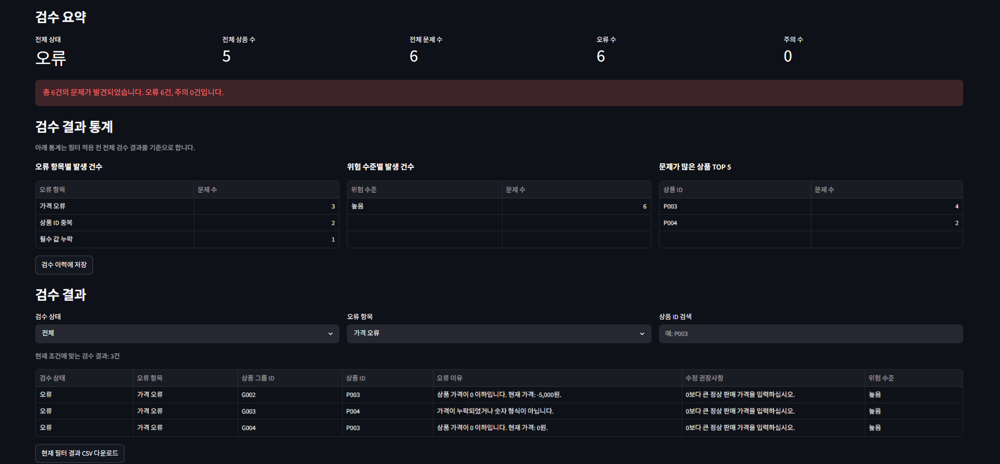

<!-- 역할: CatalogGuard Lite를 포트폴리오용으로 소개하는 프로젝트 설명 문서입니다. -->

# CatalogGuard Lite 포트폴리오 소개

## 6.1 프로젝트 한 줄 소개

CatalogGuard Lite는 상품 운영자가 CSV로 관리하는 상품 목록을 업로드하면 FastAPI 서버가 데이터 오류, 중복 상품, 가격 이상치, 개인정보 포함 여부를 검수하고 결과를 Streamlit 화면과 CSV로 제공하는 품질 검사 도구입니다.

- 배포 URL: https://catalogguard-lite-p6jtwmdhwqcapphpghfzduo.streamlit.app/
- 개발 언어: Python
- 화면 프레임워크: Streamlit
- 데이터 처리: pandas
- 테스트: pytest
- CI: GitHub Actions

## 6.2 문제 정의

상품 CSV는 운영 업무에서 자주 쓰이지만, 사람이 직접 확인하면 다음 문제가 반복됩니다.

- 필수 컬럼이나 필수 값이 빠진 채 등록될 수 있습니다.
- 상품 ID, 상품명, 상품 내용이 중복될 수 있습니다.
- 재고와 가격이 숫자 형식에 맞지 않을 수 있습니다.
- 상품명은 상의인데 카테고리는 하의처럼 입력될 수 있습니다.
- 설명이나 판매자 정보에 전화번호, 이메일, 주민등록번호 형태, 계좌번호 의심 값이 섞일 수 있습니다.
- 검수 결과를 다시 공유할 때 CSV 한글 깨짐이나 수식 삽입 같은 문제가 생길 수 있습니다.
- Streamlit과 서버가 같은 CSV를 각각 검수하면 결과·저장·화면 표시가 어긋날 수 있고, 같은 검수를 두 번 수행하는 비용도 발생합니다.

이 프로젝트는 위 문제를 작은 웹 앱 안에서 업로드, 검수, 미리보기, 필터링, 다운로드까지 한 번에 처리하도록 만든 MVP입니다.

## 6.3 해결 목표

프로젝트의 목표는 단순한 CSV 뷰어가 아니라, 운영자가 바로 사용할 수 있는 검수 흐름을 만드는 것이었습니다.

- 사용자는 CSV만 업로드하면 됩니다.
- 앱은 검수 전에 파일 자체가 안전하고 읽을 수 있는지 확인합니다.
- 화면 미리보기에는 개인정보로 보이는 값을 가려서 보여줍니다.
- 실제 검수는 FastAPI 서버의 공통 서비스가 원본 데이터로 한 번 수행합니다.
- Streamlit은 업로드 검증과 개인정보 마스킹 미리보기를 담당하고, 서버의 상세 응답을 결과 화면에 재사용합니다.
- 서버 응답은 실행 ID, 요약, 상세 결과 필드를 검증한 뒤에만 화면 상태에 반영합니다.
- 검수 결과는 사용자가 이해할 수 있는 한글 메시지와 수정 권장사항으로 보여줍니다.
- 필터 적용 전 전체 결과를 오류 항목별, 위험 수준별, 상품별로 집계해 보여줍니다.
- 필터링한 결과만 CSV로 다운로드할 수 있습니다.

## 6.4 사용자 흐름

```text
앱 접속
-> CSV 입력 템플릿 다운로드
-> 상품 CSV 작성 또는 기존 CSV 준비
-> CSV 업로드
-> 상품 데이터 미리보기 확인
-> 검수 실행 및 이력 저장 버튼 클릭
-> FastAPI POST로 서버 검수·저장
-> FastAPI GET 상세 응답을 화면에 표시
-> 필터 적용 전 전체 검수 결과 통계 확인
-> 검수 결과 필터링
-> 현재 필터 결과 CSV 다운로드
```

업로드 후 앱 내부 흐름은 다음과 같습니다.

```text
업로드 파일 bytes
-> validate_and_read_uploaded_csv()
-> validated_df
-> create_masked_preview(validated_df)
-> 검수 실행 및 이력 저장 버튼
-> CatalogGuardApiClient
-> FastAPI POST /api/v1/inspections
-> 서버의 core.inspection_service와 core.rules
-> PostgreSQL 저장 또는 기존 실행 재사용
-> FastAPI GET /api/v1/inspections/{inspection_run_id}
-> 서버 상세 응답 검증
-> build_history_detail_dataframe()
-> build_inspection_statistics(result_df)
-> render_inspection_statistics(result_df)
-> build_validation_result_csv(filtered_result_df)
```

## 6.5 기술 스택과 검증 버전

| 항목 | 버전 또는 값 |
|---|---|
| Python | 3.11.15 |
| Streamlit | 1.58.0 |
| pandas | 3.0.3 |
| pytest | 9.1.1 |
| CI | GitHub Actions `Test` workflow |
| CI 테스트 DB | PostgreSQL 18 서비스 컨테이너 |
| CI 검증 범위 | Alembic 마이그레이션, 전체 pytest, Streamlit 서버 시작과 Health 응답 |
| 필수 컬럼 | 9개 |
| 선택 컬럼 | 2개 |
| 등록된 검수 규칙 함수 | 10개 |
| 샘플 CSV 상품 수 | 5개 |
| 샘플 CSV 검수 결과 | 오류 6건, 주의 0건 |
| 최신 로컬 테스트 결과 | 722 passed, 25 skipped, 0 failed |
| CI 결과 확인 기준 | 최신 `Test` workflow의 상태·결론·커밋 SHA를 Actions 실행에서 확인 |
| 최신 CI Streamlit 시작 검사 | Health HTTP 200, body `ok` |

## 6.6 핵심 구현 구조

| 파일 | 역할 |
|---|---|
| `app.py` | 업로드 검증·마스킹 미리보기, FastAPI 검수 요청·상세 응답 표시, 공통 통계 UI |
| `clients/catalogguard_api.py` | FastAPI 검수 실행·상세 조회와 오류 요청 ID 전달 |
| `config/settings.py` | 컬럼, 허용 카테고리, 업로드 제한, 금지어 설정 |
| `core/upload_validator.py` | CSV 업로드 사전 검증 |
| `core/loader.py` | DataFrame을 Product 객체로 변환 |
| `core/models.py` | Product, ValidationIssue 데이터 모델 |
| `core/rules.py` | 전체 검수 규칙 실행 |
| `core/privacy.py` | 개인정보 정규식, 마스킹, 미리보기 복사본 생성 |
| `core/presentation.py` | 검수 결과 한글화, 필터링, 화면용 DataFrame 생성과 통계 집계 |
| `core/result_exporter.py` | 결과 CSV 생성과 수식 삽입 방어 |
| `core/product_template.py` | 입력 템플릿 CSV 생성 |
| `core/duplicate_detector.py` | 상품 ID와 상품명 중복 탐지 |
| `core/price_anomaly_detector.py` | 카테고리별 가격 이상치 탐지 |
| `core/category_mismatch_detector.py` | 상품명 키워드 기반 카테고리 불일치 탐지 |

## 6.7 데이터 보호 설계

개인정보 미리보기 기능에서 가장 중요하게 본 점은 원본 데이터와 표시용 데이터를 분리하는 것이었습니다.

```text
validated_df
-> 원본 DataFrame
-> Product 변환과 검수 규칙 실행에 사용

masked_preview_df
-> validated_df.copy(deep=True)로 만든 복사본
-> Streamlit 미리보기 표에만 사용
```

마스킹 대상은 전화번호, 이메일, 주민등록번호 형태입니다.

```text
010-1234-5678 -> 010-****-5678
sample@test.com -> sa****@test.com
900101-1234567 -> 900101-*******
```

숫자형 업무 컬럼인 `product_group_id`, `product_id`, `stock`, `price`는 미리보기 마스킹 대상에서 제외했습니다. 이 결정은 상품 ID, 가격, 재고가 전화번호나 주민등록번호 형태로 잘못 가려지는 위험을 줄이기 위한 것입니다.

## 6.8 검수 규칙 설계

현재 검수 규칙은 `core/rules.py`의 `RULES` 리스트에 등록된 함수 순서대로 실행됩니다.

- 상품 ID 중복
- 상품명 중복 후보
- 완전 중복 상품
- 필수 값 누락
- 카테고리 오류
- 재고 오류와 품절 상품
- 가격 오류
- 카테고리별 가격 이상치
- 상품명과 카테고리 불일치
- 금지어와 개인정보 형태

규칙 실행 결과는 `ValidationIssue` 객체로 통일했습니다. 이 덕분에 어떤 규칙에서 발견된 문제든 `severity`, `product_id`, `product_group_id`, `message`라는 같은 형태로 화면과 CSV 다운로드에 전달할 수 있습니다.

## 6.9 CSV 검증과 템플릿

CSV 업로드는 `core/upload_validator.py`에서 사전에 검사합니다.

- CSV 확장자 검사
- 5MB 크기 제한
- UTF-8 BOM, UTF-8, CP949 인코딩 지원
- 빈 파일 차단
- 일반 텍스트가 아닌 파일 차단
- 빈 컬럼명 차단
- 중복 컬럼명 차단
- 필수 컬럼 누락 차단
- 행별 열 개수 불일치 차단
- 10,000행 초과 차단

입력 템플릿은 `core/product_template.py`에서 메모리상 CSV bytes로 생성합니다. 템플릿에는 실제 개인정보가 아닌 가짜 예시 상품 1개만 포함합니다.

## 6.10 결과 표시와 다운로드

검수 결과 화면은 사용자가 바로 조치할 수 있도록 한글 문장 중심으로 구성했습니다.

- 검수 상태
- 오류 항목
- 상품 그룹 ID
- 상품 ID
- 오류 이유
- 수정 권장사항
- 위험 수준

CSV 다운로드는 `core/result_exporter.py`에서 처리합니다. 다운로드 전 결과 DataFrame을 복사하고, Excel에서 수식으로 해석될 수 있는 문자열을 안전하게 바꾼 뒤 UTF-8 BOM CSV bytes로 변환합니다.

검수 통계에서는 필터 적용 전 전체 결과를 기준으로 다음 항목을 분석합니다.

- 오류 항목별 문제 건수
- 위험 수준별 문제 건수
- 문제가 많은 상품 TOP 5

CSV 검수 화면과 저장된 검수 이력 상세 화면은 같은 통계 UI를 재사용합니다. CSV 검수 화면에서 상세 결과 필터를 바꿔도 전체 통계는 유지되고, 상세 결과 표와 현재 필터 결과 CSV만 선택한 조건에 따라 달라집니다.

### 검수 이력 저장과 조회

FastAPI와 PostgreSQL이 함께 실행되는 로컬 또는 별도 배포 환경에서는 검수 결과를 PostgreSQL에 이력으로 저장할 수 있습니다. 검수 이력 화면에서는 파일명, 날짜 범위와 검수 상태로 저장된 실행을 검색하고 페이지 단위로 조회하며, 현재 검색 조건에 맞는 전체 이력 요약을 CSV로 내려받을 수 있습니다.

사용자는 저장된 실행을 검색하고 하나를 선택한 뒤 문제별 오류 이유와 수정 권장사항을 확인하고 상세 결과를 CSV로 내려받습니다. 상세 화면에서는 파일명, 검수 시간, 요약 수치와 문제별 위험 수준도 함께 확인할 수 있습니다.





### 검수 결과 통계

아래 화면에는 검수 요약과 오류 항목별·위험 수준별·상품별 통계 3종이 표시됩니다. `가격 오류` 필터를 적용해 상세 결과는 3건만 보이지만, 통계는 필터 적용 전 전체 문제 6건을 기준으로 유지됩니다.



## 6.11 테스트 전략

테스트는 기능 단위로 분리했습니다.

| 테스트 파일 | 검증 대상 |
|---|---|
| `tests/test_upload_validator.py` | CSV 업로드 사전 검증 |
| `tests/test_loader.py` | CSV와 DataFrame 로딩 |
| `tests/test_rules.py` | 전체 검수 규칙 |
| `tests/test_duplicate_detector.py` | 중복 상품 탐지 |
| `tests/test_price_anomaly_detector.py` | 가격 이상치 탐지 |
| `tests/test_category_mismatch_detector.py` | 상품명과 카테고리 불일치 탐지 |
| `tests/test_privacy.py` | 개인정보 마스킹과 원본 보존 |
| `tests/test_presentation.py` | 결과 표시, 필터링, 한글 메시지, 통계 집계 |
| `tests/test_result_exporter.py` | 결과 CSV 다운로드 |
| `tests/test_product_template.py` | 입력 템플릿 |
| `tests/test_app_smoke.py` | AppTest 기반 초기 렌더링과 API 주소 누락 시 안전한 화면 처리 |
| `tests/test_database_connection.py` | PostgreSQL 연결과 테스트 DB 보호 조건 |
| `tests/test_database_models.py` | PostgreSQL 모델과 제약 조건 |
| `tests/test_inspection_persistence.py` | 검수 이력 저장·조회 통합 흐름 |

통계 집계 함수와 서버 응답 적용 helper에는 정렬, 빈 값 처리, 필수 컬럼 검증, 입력 불변성, TOP 5 적용 위치, malformed 응답 차단을 확인하는 테스트를 추가했습니다. 로컬에서는 `TEST_DATABASE_URL`을 설정하지 않은 상태로 전체 테스트를 실행해 다음 결과를 확인했습니다. 이때 PostgreSQL 연결 및 저장 통합 테스트 25개는 skipped 처리됩니다.

```text
722 passed, 25 skipped, 0 failed
```

위 수치는 현재 개발 PC의 로컬 결과이며 GitHub Actions 테스트 개수와 혼동하지 않습니다.

GitHub Actions CI에서는 `main` 브랜치 push 또는 `main` 대상 pull request마다 일회성 PostgreSQL 18 서비스 컨테이너를 시작합니다. 서비스 컨테이너는 workflow 실행 중에만 사용할 테스트용 PostgreSQL이며 Railway나 운영 DB와 분리됩니다. CI는 이 DB에 `DATABASE_URL`과 `TEST_DATABASE_URL`을 설정하고 Alembic 마이그레이션을 적용한 뒤, 단위 테스트와 PostgreSQL 통합 테스트를 포함한 전체 pytest를 한 번 실행합니다. 이어서 실제 Streamlit 서버의 시작과 Health 응답을 확인합니다.

```text
main push 또는 main 대상 pull request
-> GitHub Actions Test workflow
-> 일회성 PostgreSQL 18 서비스 컨테이너
-> Alembic upgrade head
-> 전체 pytest 1회 실행
-> Streamlit 서버 시작
-> /_stcore/health 응답 확인
-> Streamlit 프로세스 종료
```

최신 GitHub Actions 실행의 정확한 run ID, run number, event, status, conclusion, commit SHA는 배포 후 `Test` workflow 상세 화면에서 확인합니다. 이 문서에서는 Actions의 테스트 개수 대신 로컬 결과와 workflow 검증 범위를 구분해 기록합니다.

## 6.12 샘플 데이터 기준 결과

`data/dev/products_dev.csv`는 개발 중 기본 동작을 확인하기 위한 샘플입니다.

```text
전체 상품 수: 5
전체 문제 수: 6
오류 수: 6
주의 수: 0
```

이 샘플은 앱 화면에서 검수 요약, 결과 표, 필터, CSV 다운로드가 연결되어 있는지 확인하는 기준 데이터로 사용할 수 있습니다.

## 6.13 구현 중 해결한 문제

### 원본 데이터와 미리보기 데이터 분리

개인정보 마스킹을 적용할 때 원본 DataFrame을 직접 수정하면 실제 검수 결과도 마스킹된 값으로 바뀔 수 있습니다. 이를 막기 위해 `create_masked_preview()`는 `dataframe.copy(deep=True)`로 복사본을 만든 뒤 미리보기용 DataFrame에만 마스킹을 적용합니다.

### 숫자형 컬럼 오탐 방지

전화번호와 주민등록번호 형태는 숫자 패턴이 많기 때문에 가격, 재고, 상품 ID를 잘못 가릴 위험이 있습니다. 그래서 `product_group_id`, `product_id`, `stock`, `price` 컬럼은 미리보기 마스킹 대상에서 제외했습니다.

### 가격 오류와 가격 이상치 분리

0원, 음수, 숫자가 아닌 가격은 통계 계산에 넣으면 중앙값이 왜곡됩니다. 그래서 `check_price()`에서 가격 오류를 먼저 잡고, `core/price_anomaly_detector.py`에서는 양수 가격만 중앙값 계산에 사용하도록 분리했습니다.

### 같은 상품 그룹의 정상 옵션 처리

같은 상품명이라도 같은 그룹 안에서 색상이나 사이즈가 다른 상품은 정상 옵션일 수 있습니다. `core/duplicate_detector.py`는 같은 그룹의 다른 상품 ID이고 색상 또는 사이즈가 명확히 다르면 상품명 중복 후보에서 제외합니다.

### 다운로드 CSV 안전 처리

검수 결과를 CSV로 내려받을 때 셀이 `=`, `+`, `-`, `@`로 시작하면 Excel에서 수식처럼 해석될 수 있습니다. `core/result_exporter.py`는 다운로드용 복사본에서만 값을 안전하게 바꿔 원본 결과 DataFrame을 보존합니다.

### 필터와 독립된 통계와 공통 UI

상세 결과 필터를 통계에도 적용하면 전체 데이터의 문제 분포를 파악하기 어렵고, CSV 검수 화면과 이력 상세 화면에서 직접 집계하면 같은 기능이 중복될 수 있습니다. 이를 해결하기 위해 집계 로직을 입력 DataFrame을 변경하지 않는 순수 함수 `build_inspection_statistics()`로 분리하고, 공통 UI helper `render_inspection_statistics()`를 구현하였습니다.

```text
필터 전 전체 결과 result_df
-> build_inspection_statistics()
-> 오류 항목별 / 위험 수준별 / 상품별 집계
-> render_inspection_statistics()
-> CSV 검수 화면과 검수 이력 상세 화면에 공통 표시

필터 결과 filtered_result_df
-> 상세 결과 표와 현재 필터 결과 CSV에 사용
```

TOP 5 제한은 집계 함수가 아닌 UI에서 적용하였습니다. 통계 합계와 저장된 요약의 전체 문제 수가 다르면 표시를 중단하고, 통계 생성 예외 원문이나 API 응답 원문, DB 정보는 사용자 화면에 노출하지 않습니다. 그 결과 필터를 변경해도 전체 통계 수치는 유지되고 상세 표만 바뀝니다. 또한 DB, API, Alembic migration 구조를 변경하지 않고 동일한 기능을 두 화면에서 재사용하였습니다.

### 동기 검수 성능 측정과 의사결정

동기 검수의 비용을 확인하기 위해 `scripts/benchmark_inspection.py`를 추가했습니다. 재현 가능한 합성 CSV를 행 수 100, 1,000, 5,000, 10,000으로 생성하고, 워밍업 1회·반복 3회의 중앙값과 `tracemalloc` Python peak를 측정했습니다.

측정 환경은 Python 3.11.9, Windows 10.0.26200, Intel Core i7-14700F 기반의 개발 PC입니다.

| 행 수 | 입력 크기 | 문제 수 | 1회 중앙값 | 연속 2회 중앙값 | Python peak |
|---:|---:|---:|---:|---:|---:|
| 100 | 0.016 MiB | 15 | 0.009544초 | 0.018815초 | 0.177 MiB |
| 1,000 | 0.156 MiB | 149 | 0.074266초 | 0.150817초 | 1.603 MiB |
| 5,000 | 0.781 MiB | 757 | 0.371740초 | 0.867245초 | 6.485 MiB |
| 10,000 | 1.563 MiB | 1,507 | 0.875495초 | 1.645721초 | 12.939 MiB |

시간과 Python 추적 메모리는 행 수에 따라 대체로 선형으로 증가했고, 같은 검수를 두 번 수행하면 1회 대비 약 1.88~2.33배가 걸렸습니다. 10,000행 1회 검수는 개발 PC에서 약 0.88초였지만, 이 결과는 AWS 인스턴스나 대규모 트래픽 성능을 보증하지 않습니다. DB·네트워크 시간과 실제 동시성은 제외했으며 `tracemalloc`은 Pandas/C 확장 및 OS 전체 프로세스 메모리를 포함하지 않을 수 있습니다.

이 측정으로 Streamlit과 FastAPI가 각각 전체 검수를 수행하는 구조보다 서버를 단일 검수 기준으로 두는 작업을 우선했습니다. 현재 규모에서는 Redis/Celery 도입을 결론내리지 않고, 다음 최적화 후보를 동일 파일 SHA와 검수 버전의 사전 조회로 한정했습니다.

### Streamlit·FastAPI 이중 검수 제거

기존 흐름은 Streamlit에서 업로드한 DataFrame을 먼저 전체 검수한 뒤 저장 시 FastAPI에 같은 파일을 다시 보내 서버가 다시 검수하는 구조였습니다. 최신 흐름은 다음과 같이 바꾸었습니다.

```text
Streamlit: 업로드 검증·마스킹 미리보기
-> 검수 실행 및 이력 저장 버튼
-> FastAPI POST /api/v1/inspections
-> 서버 공통 검수 서비스·PostgreSQL 저장
-> FastAPI GET /api/v1/inspections/{inspection_run_id}
-> Streamlit이 상세 응답을 화면·통계·필터·다운로드에 재사용
```

따라서 전체 규칙은 요청당 서버에서 한 번만 실행되고, 저장 버튼은 POST 한 번과 상세 GET 한 번으로 동작합니다. 같은 세션에서 동일 파일을 다시 제출하면 `saved_file_hash`, `saved_inspection_run_id`를 사용해 결과 재사용을 시도하며, DB의 파일 해시·검수 버전 중복 제약은 세션 밖에서도 최종 방어선으로 유지합니다.

### 서버 응답 방어 검증

서버 상세 응답을 성공으로 간주하기 전에 실행 ID가 생성 응답과 일치하는지, `created`가 Boolean인지, 요약 수치가 음이 아닌 정수인지, 상세 결과 각 행에 필요한 문자열 필드가 있는지 검증합니다. 검증을 통과한 뒤에만 Streamlit 세션 상태와 화면 DataFrame을 갱신하므로 malformed 응답이 성공 결과로 캐시되는 경로를 차단했습니다.

### PostgreSQL 통합 테스트의 CI 자동화

로컬 개발 환경에서는 `TEST_DATABASE_URL`이 없으면 운영 DB 오연결을 막기 위해 PostgreSQL 통합 테스트 25개를 건너뜁니다. 이 보호 조건을 완화하지 않고도 전체 통합 테스트를 반복 실행할 수 있도록 GitHub Actions에 PostgreSQL 18 서비스 컨테이너를 구성하고, 두 DB 환경변수가 같은 일회성 CI 테스트 DB만 가리키도록 했습니다.

CI는 테스트 전에 `20260703_0001`, `20260705_0002` Alembic 마이그레이션을 적용합니다. 로컬 결과는 `722 passed, 25 skipped`이며, CI의 실제 테스트 개수는 각 GitHub Actions 실행 결과에서 별도로 확인합니다.

### Streamlit 서버 시작 스모크 테스트

#### 문제

기존 CI는 함수, DB, API 테스트를 확인했지만 실제 Streamlit 서버가 시작되는지는 확인하지 못하였습니다. 모든 pytest가 통과해도 Streamlit 실행 프로세스가 시작 단계에서 종료되는 문제는 놓칠 수 있었습니다.

#### 해결 방법

기존 pytest Step 뒤에 Streamlit 시작 스모크 테스트를 추가하였습니다. Streamlit을 백그라운드에서 실행하고 `/_stcore/health`를 최대 30초 동안 반복 확인한 뒤, HTTP `200` 이후에도 프로세스가 살아 있는지 추가로 확인하였습니다. 성공과 실패 모두 cleanup 처리를 거쳐 프로세스를 종료하고, 실패 시에는 실행 로그와 마지막 HTTP 결과를 출력하도록 하였습니다.

이 검사에서는 `CATALOGGUARD_API_BASE_URL`, `CATALOGGUARD_API_TIMEOUT_SECONDS`, `DATABASE_URL`, `TEST_DATABASE_URL`을 빈 값으로 덮어써 Railway 운영 API와 운영 PostgreSQL 접근을 차단하였습니다. 따라서 운영 데이터나 검수 이력을 읽거나 저장하지 않고 Streamlit 서버 자체의 시작 가능 여부만 확인합니다.

#### 설계 판단

별도 스크립트 파일을 추가하지 않고 기존 Workflow의 Bash Step으로 구현하였습니다. 단순한 고정 대기 대신 최대 30초 동안 반복 요청해 준비 시간이 달라지는 상황에 대응하고, 실패 원인을 확인할 수 있도록 로그를 남겼습니다. 또한 AppTest 기반 초기 화면 검사와 실제 서버 프로세스·포트·Health 검사를 분리해 검증 범위를 보완하였습니다.

#### 결과

최신 CI에서 PostgreSQL 마이그레이션과 Streamlit 서버 시작 스모크 테스트가 성공했으며, Health HTTP `200`과 `ok` 응답을 반환하였습니다. Actions의 테스트 개수와 실행 시간은 해당 workflow 상세 결과를 기준으로 확인합니다.

이 검사는 Streamlit 실행 명령과 서버 Health endpoint를 확인하는 시작 단계 검사입니다. 브라우저 기능 전체나 CSV 검수 흐름, 운영 배포 환경을 자동으로 검증한다는 의미는 아닙니다.

## 6.14 면접 예상 질문과 답변

### Q1. 왜 Streamlit을 사용했나요?

CSV 업로드, 표 표시, 요약 지표, 다운로드 버튼을 빠르게 구현할 수 있고 Python 데이터 처리 코드와 자연스럽게 연결되기 때문입니다. 이 프로젝트의 목적은 복잡한 프론트엔드보다 검수 로직과 사용자 흐름 검증에 가까웠습니다.

### Q2. 왜 원본 DataFrame을 직접 마스킹하지 않았나요?

미리보기 보안과 검수 정확도는 서로 다른 요구사항입니다. 원본을 마스킹하면 검수 규칙이 실제 입력값을 보지 못할 수 있으므로, 원본은 검수에 쓰고 복사본만 화면 표시용으로 사용했습니다.

### Q3. 개인정보 탐지는 완벽한가요?

아닙니다. 현재는 정규식 기반이므로 오탐과 미탐 가능성이 있습니다. 다만 MVP 단계에서는 전화번호, 이메일, 주민등록번호 형태처럼 명확한 패턴을 우선 처리하고, 테스트로 원본 보존과 문장 내부 마스킹을 검증했습니다.

### Q4. 가격 이상치는 어떤 기준인가요?

같은 카테고리의 유효 가격이 5개 이상일 때 중앙값을 계산합니다. 현재 가격이 중앙값의 0.25배보다 낮거나 4배보다 높으면 주의 항목으로 표시합니다.

### Q5. 상품명 중복과 완전 중복의 차이는 무엇인가요?

상품명 중복은 정규화된 상품명이 같은 후보를 찾는 규칙이고, 완전 중복은 상품명, 카테고리, 색상, 사이즈, 가격까지 모두 같은 상품을 찾는 규칙입니다. 완전 중복은 더 강한 근거가 있으므로 오류로 봅니다.

### Q6. 업로드 검증을 검수 규칙과 분리한 이유는 무엇인가요?

파일 형식 문제와 상품 데이터 품질 문제는 성격이 다릅니다. 파일을 읽을 수 없거나 필수 컬럼이 없으면 Product 객체를 만들 수 없으므로, 검수 규칙 실행 전에 `upload_validator`에서 먼저 차단했습니다.

### Q7. 결과 메시지를 왜 별도 파일에서 한글화했나요?

검수 규칙은 내부적으로 안정적인 rule 이름과 message를 만들고, 화면 표시용 문장은 `core/presentation.py`에서 변환합니다. 이렇게 하면 규칙 로직과 사용자 표시 문구를 독립적으로 관리할 수 있습니다.

### Q8. 테스트는 어떤 기준으로 나눴나요?

파일 업로드, 로딩, 규칙, 개인정보, 결과 표시, 다운로드, 템플릿처럼 책임 단위로 나눴습니다. 기능이 늘어날 때 어느 영역이 깨졌는지 빠르게 찾기 위한 구조입니다.

### Q9. 결과 CSV에서 수식 삽입을 고려한 이유는 무엇인가요?

운영자는 결과 CSV를 Excel에서 열 가능성이 높습니다. CSV 셀이 수식으로 해석되면 의도하지 않은 동작이 생길 수 있어 다운로드용 데이터에서 수식 접두 문자를 안전하게 처리했습니다.

### Q10. 데이터베이스 테스트를 어떻게 자동화했나요?

`main` push와 `main` 대상 pull request에서 GitHub Actions가 일회성 PostgreSQL 18 서비스 컨테이너를 시작하도록 구성했습니다. `DATABASE_URL`과 `TEST_DATABASE_URL`은 이 CI 테스트 DB만 가리키며, Alembic 마이그레이션을 먼저 적용한 뒤 전체 pytest를 한 번 실행합니다. 그래서 로컬에서 테스트 DB가 없어 skipped되는 PostgreSQL 통합 테스트 25개도 CI에서는 실행되고, 운영 DB와는 분리됩니다.

### Q11. 이 프로젝트의 다음 개선점은 무엇인가요?

실제 운영 데이터가 충분하다면 카테고리별 가격 기준을 설정 파일로 분리하고, 개인정보 탐지 패턴을 운영 정책에 맞게 확장하며, 저장된 검수 이력의 삭제와 보관 정책을 추가할 수 있습니다.

## 6.15 포트폴리오 소개 문구

### 이력서용 짧은 설명

CSV 상품 데이터를 업로드해 필수 값, 카테고리, 재고, 가격, 중복 상품, 개인정보 포함 여부를 자동 검수하는 Streamlit 기반 데이터 품질 검사 도구를 구현했습니다.

### 포트폴리오용 설명

CatalogGuard Lite는 상품 운영자가 CSV 업로드만으로 상품 데이터 품질을 확인할 수 있는 검수 앱입니다. 업로드 검증, 원본 보존형 개인정보 마스킹 미리보기, 중복 상품 탐지, 가격 이상치 탐지, 상품명과 카테고리 불일치 탐지, 필터와 독립된 전체 결과 통계, 결과 필터링, CSV 다운로드까지 하나의 흐름으로 구성했습니다. 전체 검수는 FastAPI 서버에서 한 번 수행하고 PostgreSQL에 저장한 상세 응답을 Streamlit 화면과 이력 조회에서 재사용하도록 구현했습니다. 현재 로컬에서는 `722 passed, 25 skipped`를 확인했으며, GitHub Actions에서는 실제 Streamlit 서버의 시작과 Health HTTP `200` 응답을 별도로 검증합니다.

### 면접에서 강조할 포인트

- 원본 데이터와 표시용 데이터를 분리해 개인정보 노출 위험과 검수 정확도를 함께 관리했습니다.
- CSV 업로드 검증, 규칙 실행, 결과 표시, 다운로드를 책임별 모듈로 나눴습니다.
- 정규식 기반 탐지의 한계를 인정하고, 숫자형 컬럼 오탐 방지와 원본 보존 테스트를 추가했습니다.
- 운영자가 이해할 수 있도록 내부 오류를 한글 메시지와 수정 권장사항으로 바꿨습니다.
- 일회성 PostgreSQL 18 테스트 DB에 Alembic 마이그레이션을 적용한 뒤 전체 테스트를 실행해 운영 DB와 분리된 통합 검증 흐름을 구성했습니다.
- 전체 pytest 뒤에 운영 서비스와 분리된 Streamlit 시작 검사를 실행해 실제 서버 프로세스와 Health 응답까지 검증 범위를 보완했습니다.
