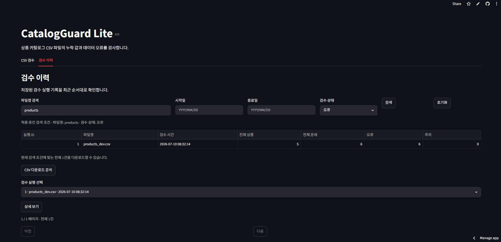
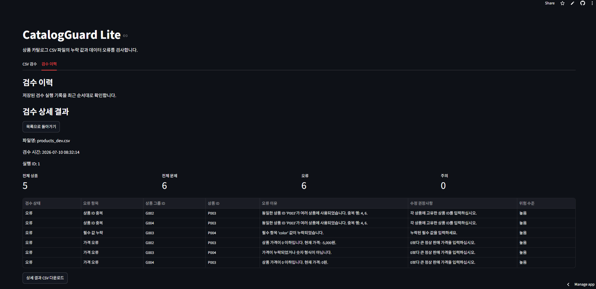
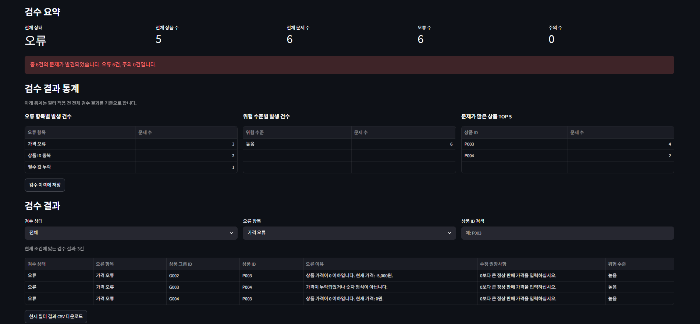

<!-- 역할: CatalogGuard Lite를 포트폴리오용으로 소개하는 프로젝트 설명 문서입니다. -->

# CatalogGuard Lite 포트폴리오 소개

## 6.1 프로젝트 한 줄 소개

CatalogGuard Lite는 Python·FastAPI 백엔드와 PostgreSQL 저장 계층을 중심으로 상품 CSV의 데이터 품질을 검수하고, ETL staging 결과를 선택적으로 운영 상품에 반영하는 품질 검사 도구입니다. 공급사 CSV의 Profile 기반 표준화·적재는 CLI와 Streamlit 웹 업로드가 같은 ETL Pipeline·loader를 공유하며, Streamlit은 저장된 batch를 선택해 preview·승인·promotion을 요청하고 FastAPI와 PostgreSQL이 반영·audit·conflict-safe rollback을 처리합니다.

- 배포 URL: https://catalogguard-lite-p6jtwmdhwqcapphpghfzduo.streamlit.app/
- 개발 언어: Python
- 화면 프레임워크: Streamlit
- 데이터 처리: pandas
- 테스트: pytest
- CI: GitHub Actions

## 이력서용 프로젝트 요약

### 프로젝트명

CatalogGuard Lite

### 한 줄 요약

Python·FastAPI와 PostgreSQL을 기반으로 상품 CSV의 형식·중복·가격·카테고리·개인정보 문제를 검수하고 결과 이력까지 관리하는 데이터 품질 서비스입니다.

### 기술 스택

Python, FastAPI, PostgreSQL, SQLAlchemy, Alembic, Redis, Celery, Streamlit, Docker Compose, GitHub Actions, Pytest

### 이력서용 핵심 문장

1. 상품 CSV의 필수값·형식·중복·가격·카테고리·개인정보 문제를 규칙으로 검출하고, 오류 이유와 수정 권장사항을 제공했으며 단위·API 테스트로 주요 흐름을 확인했습니다.
2. 검수 기준을 FastAPI 공통 서비스로 모으고 PostgreSQL에 실행 요약과 상세 결과를 저장했으며, API·저장 테스트로 응답과 이력 흐름을 검증했습니다.
3. 같은 CSV의 재검수를 줄이기 위해 파일 해시와 규칙 버전으로 기존 결과를 조회하고 partial unique index로 경쟁 요청을 막았으며, 중복 결과 재사용 테스트로 확인했습니다.
4. 긴 작업은 Redis·Celery로 상태를 분리하고 GitHub Actions에서 PostgreSQL·Redis·FastAPI·Worker를 연결한 비동기 E2E를 검증했습니다.
5. 공급사마다 코드를 따로 만들지 않고 JSON 프로필로 서로 다른 컬럼 구조를 표준 스키마에 매핑한 뒤, 표준 CSV와 summary JSON을 PostgreSQL staging에 배치 적재했습니다. 입력·프로필 identity 중복 방지와 transaction rollback을 구현하고 실제 PostgreSQL 18.4 임시 클러스터에서 검증했습니다.
6. PostgreSQL staging 적재 결과를 파일명·프로필명으로 검색하고 배치별 상품을 페이지 단위로 확인하는 FastAPI 조회 API를 구현했습니다. 목록 응답과 상세 응답의 범위를 분리하고 실제 PostgreSQL에서 필터·정렬·배치 격리를 검증했습니다.
7. Streamlit에 ETL 적재 이력 탭을 추가해 파일명·프로필명 AND 검색, 배치·상품 페이지네이션, 상세 SHA-256, nullable 필드와 request ID를 표시하고, AppTest로 stale 상태 초기화와 상세 오류 중복 호출 방지를 검증했습니다.
8. Playwright Chromium 실제 브라우저 E2E를 추가해 합성 공급사 CSV 변환·PostgreSQL 적재·FastAPI·Streamlit 실행부터 ETL 검색·상세·staging 상품·reject 마스킹·raw 원문 미노출까지 한 흐름으로 검증했습니다.
9. 운영 상품 persistence를 ETL staging과 분리하고, 공급사별 복합 identity·succeeded partial unique index·append-only JSONB audit·FK RESTRICT를 PostgreSQL 18에서 migration upgrade·downgrade·재-upgrade와 제약 테스트로 검증했습니다.
10. ETL batch 선택 → promotion preview → 변경 전·후 확인 → 명시적 승인 → preview hash 재검증 → 운영 상품 insert/update를 연결하고, transaction·stale 차단·중복 성공 방지·promotion run·append-only audit을 구현했습니다. Chromium E2E에서는 브라우저 메시지뿐 아니라 PostgreSQL 최종 상태까지 확인했습니다.
11. CLI 전용이던 ETL 실행을 Streamlit 업로드 화면과 FastAPI `POST /api/v1/etl-loads`로 확장하면서 변환·적재 로직(`run_pipeline()`, `load_standard_csv()`)은 새로 만들지 않고 CLI와 그대로 공유하도록 설계했으며, 배포 이미지에서 새 import 경로가 실제로 깨지는 packaging 결함과 신규 UI가 만든 접근성 이름 충돌을 CI runtime smoke·Browser E2E로 직접 잡아 최소 범위로 수정했습니다.
12. succeeded promotion을 되돌리는 rollback을 추가하면서 과거 값으로 단순 덮어쓰지 않고, 되돌리기 직전 현재 운영 상품이 해당 promotion이 만든 결과 그대로인지 재확인해 이후 발생한 정상 변경은 conflict로 보존하도록 구현했습니다. preview hash 재계산, confirmation 검증, 단일 transaction 원자성과 중복 rollback 이중 방어(service·DB unique index)를 PostgreSQL 통합 테스트로 검증했습니다.
13. Streamlit 로그인과 FastAPI JWT Access Token 발급, viewer(조회)·operator(운영 데이터 변경) 2개 역할 분리를 구현했습니다. `get_current_user()`가 토큰의 role을 그대로 신뢰하지 않고 매 요청마다 PostgreSQL `users` 테이블에서 role·is_active를 다시 확인하도록 설계해, 계정을 비활성화하면 이미 발급된 토큰도 즉시 차단되게 했습니다. 검수·ETL·Promotion·Rollback 전체 endpoint에 401(인증 실패)/403(권한 부족) 경계를 적용하고 실제 PostgreSQL 사용자·JWT로 검증했습니다.
14. Authentication 도입 과정에서 인증 dependency가 route와 같은 SQLAlchemy Session을 공유하며 SELECT가 트랜잭션을 암묵적으로 시작(autobegin)시켜 이후 쓰기 트랜잭션과 충돌하는 문제를 실제 Browser E2E로 발견하고, 관련 없는 사전 조회에는 독립된 Session을 쓰도록 최소 범위로 수정했습니다. 같은 원인으로 이미 존재하던 sync inspection API의 PostgreSQL transaction 충돌도 실제 PostgreSQL regression test로 재현·수정하고, 기존 monkeypatch 기반 테스트가 놓친 Session 상호작용 검증 공백을 보완했습니다.
15. RBAC가 "누가 실행할 수 있는지"만 통제하고 "누가 실행했는지"는 남기지 않는다는 한계를 확인한 뒤, 새 범용 Audit 테이블 대신 기존 `ETLLoadRun`·`CatalogPromotionRun`·`CatalogPromotionRollback` 실행 이력에 `actor_user_id`(`users.id` FK, `ON DELETE SET NULL`)·`actor_username`(snapshot) 컬럼을 추가하는 Actor Audit MVP를 구현했습니다. actor는 request body가 아니라 인증된 JWT `current_user`에서만 가져오도록 해 위조를 원천적으로 차단했고, 실제 PostgreSQL로 JWT actor 기록·401/403·actor 위조 방지·Promotion 실패 시 기록·legacy row 호환을 검증하는 regression test 10개를 추가했습니다.
16. 로그와 `/health`·`/ready`만으로는 요청 수·응답 시간·오류율·ETL 처리량을 숫자로 비교할 수 없다는 한계를 확인한 뒤, 기존 요청 middleware가 계산하던 duration을 재사용해 Prometheus HTTP metric(요청 수·응답 시간·상태 계열)과 Web ETL metric(신규/중복/실패, 처리 행 수)을 `GET /metrics`로 노출했습니다. 동적 ID 대신 FastAPI route template을 label로 써서 cardinality 폭증을 막고, 동일 배치 재사용 시 행 수를 다시 집계하지 않도록 설계했으며, `CATALOGGUARD_METRICS_ENABLED` 미설정 시 endpoint와 instrumentation 모두 no-op임을 실제 PostgreSQL 포함 32개 테스트로 검증했습니다.

## 6.2 문제 정의

상품 CSV는 운영 업무에서 자주 쓰이지만, 사람이 직접 확인하면 다음 문제가 반복됩니다.

- 필수 컬럼이나 필수 값이 빠진 채 등록될 수 있습니다.
- 상품 ID, 상품명, 상품 내용이 중복될 수 있습니다.
- 재고와 가격이 숫자 형식에 맞지 않을 수 있습니다.
- 상품명은 상의인데 카테고리는 하의처럼 입력될 수 있습니다.
- 설명이나 판매자 정보에 전화번호, 이메일, 주민등록번호 형태, 계좌번호 의심 값이 섞일 수 있습니다.
- 검수 결과를 다시 공유할 때 CSV 한글 깨짐이나 수식 삽입 같은 문제가 생길 수 있습니다.
- Streamlit과 서버가 같은 CSV를 각각 검수하면 결과·저장·화면 표시가 어긋날 수 있고, 같은 검수를 두 번 수행하는 비용도 발생합니다.

이 프로젝트는 위 문제를 작은 웹 앱 안에서 업로드, 검수, 미리보기, 필터링, 다운로드까지 한 번에 처리하도록 만든 MVP입니다.

## 6.3 해결 목표

프로젝트의 목표는 단순한 CSV 뷰어가 아니라, 운영자가 바로 사용할 수 있는 검수 흐름을 만드는 것이었습니다.

- 사용자는 CSV만 업로드하면 됩니다.
- 앱은 검수 전에 파일 자체가 안전하고 읽을 수 있는지 확인합니다.
- 화면 미리보기에는 개인정보로 보이는 값을 가려서 보여줍니다.
- 실제 검수는 FastAPI 서버의 공통 서비스가 원본 데이터로 한 번 수행합니다.
- Streamlit은 업로드 검증과 개인정보 마스킹 미리보기를 담당하고, 서버의 상세 응답을 결과 화면에 재사용합니다.
- 서버 응답은 실행 ID, 요약, 상세 결과 필드를 검증한 뒤에만 화면 상태에 반영합니다.
- 검수 결과는 사용자가 이해할 수 있는 한글 메시지와 수정 권장사항으로 보여줍니다.
- 필터 적용 전 전체 결과를 오류 항목별, 위험 수준별, 상품별로 집계해 보여줍니다.
- 필터링한 결과만 CSV로 다운로드할 수 있습니다.

## 6.4 사용자 흐름

```text
앱 접속
-> CSV 입력 템플릿 다운로드
-> 상품 CSV 작성 또는 기존 CSV 준비
-> CSV 업로드
-> 상품 데이터 미리보기 확인
-> 검수 실행 및 이력 저장 버튼 클릭
-> FastAPI POST로 서버 검수·저장
-> FastAPI GET 상세 응답을 화면에 표시
-> 필터 적용 전 전체 검수 결과 통계 확인
-> 검수 결과 필터링
-> 현재 필터 결과 CSV 다운로드
```

업로드 후 앱 내부 흐름은 다음과 같습니다.

```text
업로드 파일 bytes
-> validate_and_read_uploaded_csv()
-> validated_df
-> create_masked_preview(validated_df)
-> 검수 실행 및 이력 저장 버튼
-> CatalogGuardApiClient
-> FastAPI POST /api/v1/inspections
-> 서버의 core.inspection_service와 core.rules
-> PostgreSQL 저장 또는 기존 실행 재사용
-> FastAPI GET /api/v1/inspections/{inspection_run_id}
-> 서버 상세 응답 검증
-> build_history_detail_dataframe()
-> build_inspection_statistics(result_df)
-> render_inspection_statistics(result_df)
-> build_validation_result_csv(filtered_result_df)
```

공급사 파일은 다음 CLI 흐름으로 표준화한 뒤 기존 업로드 검증·검수 서비스에 연결할 수 있습니다.

```text
공급사 CSV + JSON 매핑 프로필
-> etl.profile_loader
-> etl.transformer
-> catalogguard_ready.csv
-> rejected_rows.csv
-> etl_summary.json
-> 기존 validate_and_read_uploaded_csv()·inspect_dataframe()
```

같은 변환·적재 로직을 Streamlit 업로드 화면에서도 실행할 수 있습니다. CLI 전용 실행 구간을 없애기 위한 별도 ETL 엔진이 아니라, 아래 CLI 적재 흐름이 재사용하는 `run_pipeline()`·`load_standard_csv()`를 FastAPI를 통해 그대로 호출하는 웹 실행 경로입니다.

```text
Streamlit ETL 실행 영역
-> GET /api/v1/etl-profiles (서버 allowlist 프로필 목록)
-> 공급사 CSV 업로드 + "ETL 실행 프로필" 선택
-> ETL 실행 버튼 클릭
-> POST /api/v1/etl-loads
-> etl.web_service.run_web_etl() -> run_pipeline() -> load_standard_csv()
-> ETL 적재 이력 캐시 무효화
```

표준 CSV를 DB에 적재하는 흐름은 파일 변환과 분리합니다. CLI(`etl.load_cli`)와 웹 실행 모두 이 적재 계약을 공유합니다.

```text
catalogguard_ready.csv + etl_summary.json
-> etl.load_cli 또는 POST /api/v1/etl-loads
-> summary 필수 필드·output SHA-256·loaded_rows 검증
-> (input SHA-256, profile name, profile version) 중복 조회
-> etl_load_runs + catalog_products_staging 한 트랜잭션 저장
-> GET /api/v1/etl-loads로 배치 검색
-> GET /api/v1/etl-loads/{etl_load_run_id}로 배치별 상품 조회
-> Streamlit ETL 적재 이력 탭에서 목록·상세·페이지네이션 표시
-> 사용자가 batch 직접 선택
-> POST /api/v1/etl-loads/{etl_load_run_id}/promotion-preview
-> insert/update/unchanged·상품별 변경 전후·차단 사유 확인
-> 승인 checkbox와 preview hash 확인
-> POST /api/v1/etl-loads/{etl_load_run_id}/promotions
-> 운영 상품·promotion run·audit 저장
-> 필요 시 POST /api/v1/catalog-promotions/{promotion_run_id}/rollback-preview
-> 현재 상품 상태와 promotion 결과의 conflict 확인
-> confirmation + rollback preview hash 재검증
-> POST /api/v1/catalog-promotions/{promotion_run_id}/rollback
-> INSERT 상품 삭제 / UPDATE 상품 이전 값 복원, rollback run·audit 저장
```

웹 ETL 실행 성공이 promotion을 자동으로 시작하지는 않습니다. 사용자가 ETL 적재 이력에서 새 batch를 직접 선택해야 이후 preview·승인 흐름이 시작됩니다.

## 6.5 기술 스택과 검증 버전

| 항목 | 버전 또는 값 |
|---|---|
| Python | 3.11.15 |
| Streamlit | 1.58.0 |
| API | FastAPI, Uvicorn, Pydantic |
| pandas | 3.0.3 |
| 데이터베이스 | PostgreSQL, SQLAlchemy, psycopg |
| 마이그레이션 | Alembic |
| 비동기 처리 | Redis, Celery |
| 관측성 | prometheus-client 0.25.0 (HTTP·Web ETL metric instrumentation MVP, Prometheus 서버는 미구축) |
| 로컬 실행 | Docker Compose |
| pytest | 일반 unit·integration 9.1.1 / Chromium E2E 8.4.1 |
| CI | GitHub Actions `Test` workflow |
| CI 테스트 서비스 | PostgreSQL 18·Redis 7.4 서비스 컨테이너 |
| CI 검증 범위 | 일반 `test` job의 Alembic·pytest·비동기 E2E·AWS Docker runtime smoke와 별도 `browser-e2e` job의 PostgreSQL·Chromium 실제 브라우저 ETL·promotion E2E |
| 필수 컬럼 | 9개 |
| 선택 컬럼 | 3개 (`sale_price` 포함) |
| 등록된 검수 규칙 함수 | 15개 |
| 샘플 CSV 상품 수 | 5개 |
| 샘플 CSV 검수 결과 | 오류 6건, 주의 0건 |
| ETL API client·UI 검증 | 응답 schema, nullable, request ID, stale 상태와 Streamlit AppTest 범위 |
| promotion preview·service·API·concurrency 검증 | preview hash, 승인, 차단·stale·failed, transaction, 중복 성공 방지와 audit |
| Chromium 브라우저 E2E | ETL reject 마스킹과 promotion 승인·반영, 브라우저 오류 및 PostgreSQL 최종 상태 |
| 샘플 ETL CLI 결과 | 전체 3건, 정상 변환 2건, 오류 행 1건, 종료 코드 0 |
| Web ETL·Rollback 검증 | `POST /api/v1/etl-loads`·`GET /api/v1/etl-profiles`, rollback preview/실행 API의 PostgreSQL 통합·API·client·UI 테스트 |
| Actor Audit 검증 | `tests/test_actor_audit.py` 10 scenarios: JWT actor 기록, viewer 403(세 endpoint)·Web ETL anonymous 401, actor 위조 방지, Promotion 실패 기록, legacy row 호환 |
| Prometheus Metrics 검증 | `tests/test_metrics.py` 32 scenarios: env parsing, `/metrics` disabled=404/no-op, route template cardinality 방지, `unmatched`/`5xx` 집계, 민감정보 미노출, Web ETL created/duplicate/failed와 row 중복 집계 방지, 실제 PostgreSQL 신규+중복 ETL |
| 최신 전체 pytest | `1309 passed`, `0 skipped`, `4 deselected`, `0 failed` |
| 최신 기준 CI | GitHub Actions run `31153262085` success (commit `ed564e0e`) |
| 최신 Alembic head | `20260806_0010`(이번 Observability 기능은 새 migration 없음) |
| 최신 CI Streamlit 시작 검사 | Health HTTP 200, body `ok` |

## 6.6 핵심 구현 구조

| 파일 | 역할 |
|---|---|
| `app.py` | 업로드 검증·마스킹 미리보기, 검수 화면, 검수 이력과 ETL 적재 이력 탭 연결 |
| `clients/catalogguard_api.py` | FastAPI 검수·ETL·promotion API 호출과 응답 schema·오류 mapping |
| `ui/etl_load_history.py` | ETL 목록·검색·페이지네이션·상세·promotion 승인 UI와 session state 관리 |
| `api/main.py`, `api/routes/` | FastAPI 앱, Health·readiness, 동기 검수·이력·비동기 작업 및 ETL 배치 조회 API |
| `api/routes/etl_loads.py`, `api/schemas.py` | 웹 ETL 실행·프로필 목록, ETL 조회, promotion·rollback endpoint, 오류 처리와 Pydantic 응답 계약 |
| `config/settings.py` | 컬럼, 허용 카테고리, 업로드 제한, 금지어 설정 |
| `config/metrics.py` | Prometheus 전용 `CollectorRegistry`, HTTP·Web ETL metric 4개 정의, `CATALOGGUARD_METRICS_ENABLED` 기반 no-op instrumentation helper |
| `core/upload_validator.py` | CSV 업로드 사전 검증 |
| `core/loader.py` | DataFrame을 Product 객체로 변환 |
| `core/models.py` | Product, ValidationIssue 데이터 모델 |
| `core/rules.py` | 전체 검수 규칙 실행 |
| `core/privacy.py` | 개인정보 정규식, 마스킹, 미리보기 복사본 생성 |
| `core/presentation.py` | 검수 결과 한글화, 필터링, 화면용 DataFrame 생성과 통계 집계 |
| `core/result_exporter.py` | 결과 CSV 생성과 수식 삽입 방어 |
| `core/product_template.py` | 입력 템플릿 CSV 생성 |
| `core/duplicate_detector.py` | 상품 ID와 상품명 중복 탐지 |
| `core/price_anomaly_detector.py` | 카테고리별 가격 이상치 탐지 |
| `core/category_mismatch_detector.py` | 상품명 키워드 기반 카테고리 불일치 탐지 |
| `db/etl_query_service.py` | ETL 배치 필터·정렬·count와 배치별 상품 SQL 페이지네이션을 담당하는 읽기 전용 query service |
| `db/catalog_promotion_rollback_service.py` | rollback preview 계산, conflict 판정, transaction 기반 실행(삭제/복원)과 duplicate rollback 방어 |
| `db/` | 검수 실행·상세 결과, ETL staging, 운영 상품 promotion·rollback의 PostgreSQL 모델, Repository, 저장 Service |
| `services/` | Redis 작업 상태 저장, 비동기 작업 파일 관리와 제출 Service |
| `workers/` | Celery 앱과 CSV 검수 Worker 작업 |
| `etl/web_service.py` | 업로드 bytes를 `TemporaryDirectory`로 옮겨 기존 `run_pipeline()`·`load_standard_csv()`를 실행하는 웹 ETL 진입점(`run_web_etl()`) |
| `etl/` | JSON 프로필 로딩·`profile_id` allowlist, 공급사 행 변환, reject 분리, 파일 변환 CLI와 PostgreSQL staging loader |

## 6.7 데이터 보호 설계

개인정보 미리보기 기능에서 가장 중요하게 본 점은 원본 데이터와 표시용 데이터를 분리하는 것이었습니다.

```text
validated_df
-> 원본 DataFrame
-> Product 변환과 검수 규칙 실행에 사용

masked_preview_df
-> validated_df.copy(deep=True)로 만든 복사본
-> Streamlit 미리보기 표에만 사용
```

마스킹 대상은 전화번호, 이메일, 주민등록번호 형태입니다.

```text
010-1234-5678 -> 010-****-5678
sample@test.com -> sa****@test.com
900101-1234567 -> 900101-*******
```

숫자형 업무 컬럼인 `product_group_id`, `product_id`, `stock`, `price`는 미리보기 마스킹 대상에서 제외했습니다. 이 결정은 상품 ID, 가격, 재고가 전화번호나 주민등록번호 형태로 잘못 가려지는 위험을 줄이기 위한 것입니다.

## 6.8 검수 규칙 설계

현재 검수 규칙은 `core/rules.py`의 `RULES` 리스트에 등록된 함수 순서대로 실행됩니다.

- 상품 ID 중복
- 상품명 중복 후보
- 완전 중복 상품
- 필수 값 누락
- 카테고리 오류
- 재고 오류와 품절 상품
- 가격 오류
- 카테고리별 가격 이상치
- 상품명과 카테고리 불일치
- 금지어와 개인정보 형태

규칙 실행 결과는 `ValidationIssue` 객체로 통일했습니다. 이 덕분에 어떤 규칙에서 발견된 문제든 `severity`, `product_id`, `product_group_id`, `message`라는 같은 형태로 화면과 CSV 다운로드에 전달할 수 있습니다.

## 6.9 CSV 검증과 템플릿

CSV 업로드는 `core/upload_validator.py`에서 사전에 검사합니다.

- CSV 확장자 검사
- 5MB 크기 제한
- UTF-8 BOM, UTF-8, CP949 인코딩 지원
- 빈 파일 차단
- 일반 텍스트가 아닌 파일 차단
- 빈 컬럼명 차단
- 중복 컬럼명 차단
- 필수 컬럼 누락 차단
- 행별 열 개수 불일치 차단
- 10,000행 초과 차단

입력 템플릿은 `core/product_template.py`에서 메모리상 CSV bytes로 생성합니다. 템플릿에는 실제 개인정보가 아닌 가짜 예시 상품 1개만 포함합니다.

## 6.10 결과 표시와 다운로드

검수 결과 화면은 사용자가 바로 조치할 수 있도록 한글 문장 중심으로 구성했습니다.

- 검수 상태
- 오류 항목
- 상품 그룹 ID
- 상품 ID
- 오류 이유
- 수정 권장사항
- 위험 수준

CSV 다운로드는 `core/result_exporter.py`에서 처리합니다. 다운로드 전 결과 DataFrame을 복사하고, Excel에서 수식으로 해석될 수 있는 문자열을 안전하게 바꾼 뒤 UTF-8 BOM CSV bytes로 변환합니다.

검수 통계에서는 필터 적용 전 전체 결과를 기준으로 다음 항목을 분석합니다.

- 오류 항목별 문제 건수
- 위험 수준별 문제 건수
- 문제가 많은 상품 TOP 5

CSV 검수 화면과 저장된 검수 이력 상세 화면은 같은 통계 UI를 재사용합니다. CSV 검수 화면에서 상세 결과 필터를 바꿔도 전체 통계는 유지되고, 상세 결과 표와 현재 필터 결과 CSV만 선택한 조건에 따라 달라집니다.

### 검수 이력 저장과 조회

FastAPI와 PostgreSQL이 함께 실행되는 로컬 또는 별도 배포 환경에서는 검수 결과를 PostgreSQL에 이력으로 저장할 수 있습니다. 검수 이력 화면에서는 파일명, 날짜 범위와 검수 상태로 저장된 실행을 검색하고 페이지 단위로 조회하며, 현재 검색 조건에 맞는 전체 이력 요약을 CSV로 내려받을 수 있습니다.

사용자는 저장된 실행을 검색하고 하나를 선택한 뒤 문제별 오류 이유와 수정 권장사항을 확인하고 상세 결과를 CSV로 내려받습니다. 상세 화면에서는 파일명, 검수 시간, 요약 수치와 문제별 위험 수준도 함께 확인할 수 있습니다.





### 검수 결과 통계

아래 화면에는 검수 요약과 오류 항목별·위험 수준별·상품별 통계 3종이 표시됩니다. `가격 오류` 필터를 적용해 상세 결과는 3건만 보이지만, 통계는 필터 적용 전 전체 문제 6건을 기준으로 유지됩니다.



## 6.11 테스트 전략

테스트는 기능 단위로 분리했습니다.

| 테스트 파일 | 검증 대상 |
|---|---|
| `tests/test_upload_validator.py` | CSV 업로드 사전 검증 |
| `tests/test_loader.py` | CSV와 DataFrame 로딩 |
| `tests/test_rules.py` | 전체 검수 규칙 |
| `tests/test_duplicate_detector.py` | 중복 상품 탐지 |
| `tests/test_price_anomaly_detector.py` | 가격 이상치 탐지 |
| `tests/test_category_mismatch_detector.py` | 상품명과 카테고리 불일치 탐지 |
| `tests/test_privacy.py` | 개인정보 마스킹과 원본 보존 |
| `tests/test_presentation.py` | 결과 표시, 필터링, 한글 메시지, 통계 집계 |
| `tests/test_result_exporter.py` | 결과 CSV 다운로드 |
| `tests/test_product_template.py` | 입력 템플릿 |
| `tests/test_inspection_service.py` | 선택 `sale_price`와 정상가·할인가 관계 검수 |
| `tests/test_app_smoke.py` | AppTest 기반 초기 렌더링과 API 주소 누락 시 안전한 화면 처리 |
| `tests/test_database_connection.py` | PostgreSQL 연결과 테스트 DB 보호 조건 |
| `tests/test_database_models.py` | PostgreSQL 모델과 제약 조건 |
| `tests/test_inspection_persistence.py` | 검수 이력 저장·조회 통합 흐름 |
| `tests/etl/test_web_service.py` | `run_web_etl()`의 정상 적재, 부분/전체 reject, 중복 재사용, profile allowlist 위반, 업로드 검증 실패, 임시 파일 정리 |
| `tests/test_api_etl_web_run.py` | `POST /api/v1/etl-loads` HTTP 상태·오류 code·응답 계약 |
| `tests/test_api_etl_loads.py` | ETL 배치 목록·상세 HTTP 응답과 파라미터·404 계약 |
| `tests/test_etl_query_service.py` | 실제 PostgreSQL의 ETL 검색·정렬·페이지네이션·NULL·배치 격리 |
| `tests/test_catalogguard_api_client.py` | ETL client 파라미터·응답 shape·SHA-256·nullable·404/request ID 검증 |
| `tests/test_etl_load_history_ui.py` | ETL 순수 helper와 Streamlit AppTest 검증 |
| `tests/test_api_catalog_promotion_preview.py` | promotion preview endpoint와 응답·차단 조건 검증 |
| `tests/test_api_catalog_promotions.py` | 승인·hash·blocked/stale/failed 응답과 promotion endpoint 검증 |
| `tests/test_catalog_promotion_preview_service.py` | insert/update/unchanged, before/after와 preview hash 계산 검증 |
| `tests/test_catalog_promotion_service.py` | transaction upsert, run 상태와 append-only audit 검증 |
| `tests/test_catalog_promotion_concurrency.py` | 동시 promotion의 lock·중복 성공 방지·안전한 실패 검증 |
| `tests/test_catalog_promotion_rollback_contract.py` | rollback preview·conflict 판정·실행 transaction·duplicate rollback 방어의 PostgreSQL 통합 검증 |
| `tests/e2e/test_etl_browser_e2e.py` | 실제 Chromium의 ETL 탭·검색·상세·promotion 승인·반영·reject 마스킹·브라우저 오류와 PostgreSQL 최종 상태 검증 |
| `scripts/run_etl_browser_e2e.py` | 테스트 DB migration, ETL CLI·Loader, FastAPI·Streamlit readiness, Playwright 실행과 cleanup |
| `tests/etl/` | 공급사 프로필 검증, 행 변환, 파일 교체, CLI와 기존 검수 흐름 호환성 |
| `tests/test_api_inspections.py` | ETL 출력과 연동되는 FastAPI CSV 검수·중복 결과 재사용·응답 계약 |
| `tests/test_api_inspection_jobs.py`, `tests/test_inspection_tasks.py` | 비동기 작업 API, Celery task 상태 전이와 임시 파일 정리 |
| `tests/test_actor_audit.py` | Web ETL·Promotion·Rollback의 `actor_user_id`·`actor_username`이 JWT `current_user`에서만 기록되는지, viewer 403(세 endpoint)·Web ETL anonymous 401, request body 위조 무시, Promotion 실패 기록, legacy row 호환을 실제 PostgreSQL로 검증(10 scenarios) |
| `tests/test_metrics.py` | `CATALOGGUARD_METRICS_ENABLED` parsing, `/metrics` disabled=404·instrumentation no-op, HTTP request counter·duration histogram, 동적 ID route template 집계와 `unmatched`/`5xx` 고정 label, 민감정보 미노출, Web ETL created/duplicate/failed와 row 중복 집계 방지를 실제 PostgreSQL 포함해 검증(32 scenarios) |

통계 집계 함수와 서버 응답 적용 helper에는 정렬, 빈 값 처리, 필수 컬럼 검증, 입력 불변성, TOP 5 적용 위치, malformed 응답 차단을 확인하는 테스트를 추가했습니다. 최신 기능은 GitHub Actions의 PostgreSQL 18 서비스에서 migration과 ETL staging 적재까지 실행해 다음 결과를 확인했습니다.

```text
기준 저장소의 GitHub Actions run `30972097167`: success
AWS Docker runtime smoke: image build·import(`api`·`services`·`workers`·`etl` 포함)·UID 10001·migration·기본 CMD Uvicorn·`/health` HTTP 200 확인
Web ETL·promotion·rollback preview·service·API·client·UI·concurrency 검증 파일 포함
Chromium promotion E2E: 실제 반영 후 PostgreSQL 최종 상태 확인
Streamlit startup smoke: `/_stcore/health` 범위는 workflow 결과로 확인
```

ETL 적재에서는 표준 CSV 2행을 최초 적재하고 같은 파일을 재실행해 `created=False`와 중복 상품 미생성을 확인했습니다. promotion에서는 합성 batch를 preview한 뒤 승인과 hash를 함께 보내 운영 상품 insert/update, `succeeded` run, audit 저장을 확인하고, 같은 batch의 두 번째 성공 요청은 기존 결과를 재사용하는지 확인했습니다. stale hash, 검수 오류·reject·중복 identity 차단, transaction rollback, malformed API 응답 거부와 Streamlit 상태 초기화도 검증했습니다. 모든 PostgreSQL 결과는 운영 DB가 아닌 테스트 환경의 결과입니다.

GitHub Actions CI에서는 `main` 브랜치 push 또는 `main` 대상 pull request마다 일회성 PostgreSQL 18·Redis 7.4 서비스 컨테이너를 시작합니다. 두 서비스는 workflow 실행 중에만 사용할 테스트용 구성으로 Railway나 운영 DB·Redis와 분리됩니다. 기준 저장소 상태의 run `30972097167`은 성공했으며, Alembic·pytest·AWS Docker runtime smoke·FastAPI·Celery 비동기 E2E·Streamlit startup과 별도 Chromium promotion E2E의 세부 결과는 workflow 실행 로그를 기준으로 확인합니다.

```text
main push 또는 main 대상 pull request
-> GitHub Actions Test workflow
-> 일회성 PostgreSQL 18·Redis 7.4 서비스 컨테이너
-> Alembic upgrade head
-> Dockerfile.aws image build·import(`etl` package 포함)·UID 10001 확인
-> PostgreSQL migration·기본 CMD Uvicorn·`/health` HTTP 200 확인
-> E2E 제외 전체 pytest 1회 실행
-> Celery Worker·FastAPI 프로세스 시작
-> /health·/ready 확인
-> 비동기 CSV E2E: 신규 생성·상태 polling·결과 조회·동일 파일 재사용·임시 파일 정리
-> 실패 시 FastAPI·Celery 로그 출력, 성공·실패 모두 프로세스 정리
-> Streamlit 서버 시작
-> /_stcore/health 응답 확인
-> Streamlit 프로세스 종료
```

run `30972097167`의 workflow 로그를 직접 확인한 결과 `Run tests` 단계는 `1189 passed, 4 deselected in 32.22s`로 종료되었으며(`0 skipped`, `0 failed`), AWS Docker runtime smoke와 별도 `browser-e2e` job도 모두 success였습니다. 이 숫자는 해당 커밋·run 시점의 실제 실행 결과이며, 이후 커밋에서 테스트가 추가·삭제되면 달라질 수 있으므로 실행마다 실제 CI 로그를 기준으로 확인합니다.

## 6.12 샘플 데이터 기준 결과

`data/dev/products_dev.csv`는 개발 중 기본 동작을 확인하기 위한 샘플입니다.

```text
전체 상품 수: 5
전체 문제 수: 6
오류 수: 6
주의 수: 0
```

이 샘플은 앱 화면에서 검수 요약, 결과 표, 필터, CSV 다운로드가 연결되어 있는지 확인하는 기준 데이터로 사용할 수 있습니다.

## 6.13 구현 중 해결한 문제

### 원본 데이터와 미리보기 데이터 분리

개인정보 마스킹을 적용할 때 원본 DataFrame을 직접 수정하면 실제 검수 결과도 마스킹된 값으로 바뀔 수 있습니다. 이를 막기 위해 `create_masked_preview()`는 `dataframe.copy(deep=True)`로 복사본을 만든 뒤 미리보기용 DataFrame에만 마스킹을 적용합니다.

### 숫자형 컬럼 오탐 방지

전화번호와 주민등록번호 형태는 숫자 패턴이 많기 때문에 가격, 재고, 상품 ID를 잘못 가릴 위험이 있습니다. 그래서 `product_group_id`, `product_id`, `stock`, `price` 컬럼은 미리보기 마스킹 대상에서 제외했습니다.

### 가격 오류와 가격 이상치 분리

0원, 음수, 숫자가 아닌 가격은 통계 계산에 넣으면 중앙값이 왜곡됩니다. 그래서 `check_price()`에서 가격 오류를 먼저 잡고, `core/price_anomaly_detector.py`에서는 양수 가격만 중앙값 계산에 사용하도록 분리했습니다.

### 같은 상품 그룹의 정상 옵션 처리

같은 상품명이라도 같은 그룹 안에서 색상이나 사이즈가 다른 상품은 정상 옵션일 수 있습니다. `core/duplicate_detector.py`는 같은 그룹의 다른 상품 ID이고 색상 또는 사이즈가 명확히 다르면 상품명 중복 후보에서 제외합니다.

### 다운로드 CSV 안전 처리

검수 결과를 CSV로 내려받을 때 셀이 `=`, `+`, `-`, `@`로 시작하면 Excel에서 수식처럼 해석될 수 있습니다. `core/result_exporter.py`는 다운로드용 복사본에서만 값을 안전하게 바꿔 원본 결과 DataFrame을 보존합니다.

### 필터와 독립된 통계와 공통 UI

상세 결과 필터를 통계에도 적용하면 전체 데이터의 문제 분포를 파악하기 어렵고, CSV 검수 화면과 이력 상세 화면에서 직접 집계하면 같은 기능이 중복될 수 있습니다. 이를 해결하기 위해 집계 로직을 입력 DataFrame을 변경하지 않는 순수 함수 `build_inspection_statistics()`로 분리하고, 공통 UI helper `render_inspection_statistics()`를 구현하였습니다.

```text
필터 전 전체 결과 result_df
-> build_inspection_statistics()
-> 오류 항목별 / 위험 수준별 / 상품별 집계
-> render_inspection_statistics()
-> CSV 검수 화면과 검수 이력 상세 화면에 공통 표시

필터 결과 filtered_result_df
-> 상세 결과 표와 현재 필터 결과 CSV에 사용
```

TOP 5 제한은 집계 함수가 아닌 UI에서 적용하였습니다. 통계 합계와 저장된 요약의 전체 문제 수가 다르면 표시를 중단하고, 통계 생성 예외 원문이나 API 응답 원문, DB 정보는 사용자 화면에 노출하지 않습니다. 그 결과 필터를 변경해도 전체 통계 수치는 유지되고 상세 표만 바뀝니다. 이 통계 기능 자체는 기존 검수 DB·API·Alembic 구조를 변경하지 않고 두 화면에서 재사용하였습니다.

### 동기 검수 성능 측정과 의사결정

동기 검수의 비용을 확인하기 위해 `scripts/benchmark_inspection.py`를 추가했습니다. 재현 가능한 합성 CSV를 행 수 100, 1,000, 5,000, 10,000으로 생성하고, 워밍업 1회·반복 3회의 중앙값과 `tracemalloc` Python peak를 측정했습니다.

측정 환경은 Python 3.11.9, Windows 10.0.26200, Intel Core i7-14700F 기반의 개발 PC입니다.

| 행 수 | 입력 크기 | 문제 수 | 1회 중앙값 | 연속 2회 중앙값 | Python peak |
|---:|---:|---:|---:|---:|---:|
| 100 | 0.016 MiB | 15 | 0.009544초 | 0.018815초 | 0.177 MiB |
| 1,000 | 0.156 MiB | 149 | 0.074266초 | 0.150817초 | 1.603 MiB |
| 5,000 | 0.781 MiB | 757 | 0.371740초 | 0.867245초 | 6.485 MiB |
| 10,000 | 1.563 MiB | 1,507 | 0.875495초 | 1.645721초 | 12.939 MiB |

시간과 Python 추적 메모리는 행 수에 따라 대체로 선형으로 증가했고, 같은 검수를 두 번 수행하면 1회 대비 약 1.88~2.33배가 걸렸습니다. 10,000행 1회 검수는 개발 PC에서 약 0.88초였지만, 이 결과는 AWS 인스턴스나 대규모 트래픽 성능을 보증하지 않습니다. DB·네트워크 시간과 실제 동시성은 제외했으며 `tracemalloc`은 Pandas/C 확장 및 OS 전체 프로세스 메모리를 포함하지 않을 수 있습니다.

이 측정으로 Streamlit과 FastAPI가 각각 전체 검수를 수행하는 구조보다 서버를 단일 검수 기준으로 두는 작업을 우선했습니다. 이후 긴 검수를 요청 수명과 분리할 수 있도록 Redis Job Store와 Celery Worker를 추가했고, Streamlit에서는 즉시 검수를 기본값으로 유지하면서 백그라운드 검수를 선택할 수 있게 연결했습니다. 백그라운드 상태는 무한 폴링 없이 사용자가 새로고침 버튼을 눌러 확인합니다.

### Streamlit·FastAPI 이중 검수 제거와 비동기 선택

기존 흐름은 Streamlit에서 업로드한 DataFrame을 먼저 전체 검수한 뒤 저장 시 FastAPI에 같은 파일을 다시 보내 서버가 다시 검수하는 구조였습니다. 최신 흐름은 다음과 같이 바꾸었습니다.

```text
Streamlit: 업로드 검증·마스킹 미리보기
-> 즉시 검수(기본): FastAPI POST /api/v1/inspections
-> 백그라운드 검수: FastAPI POST /api/v1/inspection-jobs
-> 상태 새로고침: GET /api/v1/inspection-jobs/{job_id}
-> 성공 시 FastAPI GET /api/v1/inspections/{inspection_run_id}
-> Streamlit이 상세 응답을 화면·통계·필터·다운로드에 재사용
```

따라서 전체 규칙은 요청당 서버에서 한 번만 실행됩니다. 즉시 검수는 POST 한 번과 상세 GET 한 번으로 동작하고, 백그라운드 검수는 작업 제출 뒤 명시적인 상태 GET으로 완료를 확인합니다. 완료된 두 흐름은 같은 상세 결과 렌더러를 사용합니다. 같은 세션에서는 업로드 bytes의 SHA-256과 활성 `job_id`로 불필요한 재제출을 막고, DB의 파일 해시·검수 버전 중복 제약은 세션 밖에서도 최종 방어선으로 유지합니다.

### 서버 응답 방어 검증

서버 상세 응답을 성공으로 간주하기 전에 실행 ID가 생성 응답과 일치하는지, `created`가 Boolean인지, 요약 수치가 음이 아닌 정수인지, 상세 결과 각 행에 필요한 문자열 필드가 있는지 검증합니다. 검증을 통과한 뒤에만 Streamlit 세션 상태와 화면 DataFrame을 갱신하므로 malformed 응답이 성공 결과로 캐시되는 경로를 차단했습니다.

### PostgreSQL 통합 테스트의 CI 자동화

로컬 개발 환경에서는 `TEST_DATABASE_URL`이 없으면 운영 DB 오연결을 막기 위해 PostgreSQL 통합 테스트를 건너뜁니다. 이 보호 조건을 완화하지 않고도 전체 통합 테스트를 반복 실행할 수 있도록 GitHub Actions와 별도 로컬 검증에서 PostgreSQL 테스트 환경만 사용했습니다.

기존 CI와 이번 작업의 migration chain은 `20260703_0001`, `20260705_0002`, `20260725_0003`, `20260727_0004`로 이어집니다. 격리된 PostgreSQL 18.4 테스트 클러스터에서 새 migration의 upgrade·downgrade·재upgrade, PostgreSQL 적재와 조회를 확인했습니다. 운영 DB 적재는 검증하지 않습니다.

### Streamlit 서버 시작 스모크 테스트

#### 문제

기존 CI는 함수, DB, API 테스트를 확인했지만 실제 Streamlit 서버가 시작되는지는 확인하지 못하였습니다. 모든 pytest가 통과해도 Streamlit 실행 프로세스가 시작 단계에서 종료되는 문제는 놓칠 수 있었습니다.

#### 해결 방법

기존 pytest Step 뒤에 Streamlit 시작 스모크 테스트를 추가하였습니다. Streamlit을 백그라운드에서 실행하고 `/_stcore/health`를 최대 30초 동안 반복 확인한 뒤, HTTP `200` 이후에도 프로세스가 살아 있는지 추가로 확인하였습니다. 성공과 실패 모두 cleanup 처리를 거쳐 프로세스를 종료하고, 실패 시에는 실행 로그와 마지막 HTTP 결과를 출력하도록 하였습니다.

이 검사에서는 `CATALOGGUARD_API_BASE_URL`, `CATALOGGUARD_API_TIMEOUT_SECONDS`, `DATABASE_URL`, `TEST_DATABASE_URL`을 빈 값으로 덮어써 Railway 운영 API와 운영 PostgreSQL 접근을 차단하였습니다. 따라서 운영 데이터나 검수 이력을 읽거나 저장하지 않고 Streamlit 서버 자체의 시작 가능 여부만 확인합니다.

#### 설계 판단

별도 스크립트 파일을 추가하지 않고 기존 Workflow의 Bash Step으로 구현하였습니다. 단순한 고정 대기 대신 최대 30초 동안 반복 요청해 준비 시간이 달라지는 상황에 대응하고, 실패 원인을 확인할 수 있도록 로그를 남겼습니다. 또한 AppTest 기반 초기 화면 검사와 실제 서버 프로세스·포트·Health 검사를 분리해 검증 범위를 보완하였습니다.

#### 결과

최신 CI에서 PostgreSQL 마이그레이션과 Streamlit 서버 시작 스모크 테스트가 성공했으며, Health HTTP `200`과 `ok` 응답을 반환하였습니다. Actions의 테스트 개수와 실행 시간은 해당 workflow 상세 결과를 기준으로 확인합니다.

이 검사는 Streamlit 실행 명령과 서버 Health endpoint를 확인하는 시작 단계 검사입니다. 브라우저 기능 전체나 CSV 검수 흐름, 운영 배포 환경을 자동으로 검증한다는 의미는 아닙니다.

### Catalog promotion E2E와 동시성에서 해결한 문제

promotion 기능을 붙이면서 단순히 브라우저에 성공 문구가 나타나는지만 확인하지 않고, 다음 문제를 실제 원인·수정·재발 방지 기준으로 정리했습니다.

1. **문제:** batch 자동 선택을 제거한 뒤 기존 E2E가 선택 없이 상세 조회를 시도했습니다.
   - **실제 원인:** UI가 사용자의 명시적 batch 선택을 요구하도록 바뀌었지만 테스트 흐름은 이전 자동 선택 가정에 남아 있었습니다.
   - **수정 방법:** 파일명·프로필명으로 batch를 검색한 뒤 `적재 배치 선택` combobox에서 option을 직접 선택하도록 시나리오를 수정했습니다.
   - **재발 방지 기준:** promotion E2E는 preview 전에 선택된 batch의 `aria-label`이 검색한 파일명과 일치하는지 확인합니다.
2. **문제:** Streamlit combobox에서 보이는 option text가 아니라 내부 text를 기준으로 선택하면 실제 선택이 검증되지 않았습니다.
   - **실제 원인:** Streamlit이 선택값을 접근성 이름인 `aria-label`로 렌더링하는 경우가 있어 내부 DOM text와 사용자에게 보이는 선택값이 달랐습니다.
   - **수정 방법:** role·label 기반 selector로 option을 선택하고 combobox의 `aria-label`을 검증했습니다.
   - **재발 방지 기준:** `nth-child`나 내부 CSS 구조가 아니라 role·label·aria-label 같은 사용자 관점 selector를 사용합니다.
3. **문제:** 숨겨진 checkbox input에 `.check()`를 호출하면 timeout이 발생했습니다.
   - **실제 원인:** Streamlit checkbox는 실제 input과 보이는 label이 분리되어 렌더링될 수 있습니다.
   - **수정 방법:** 보이는 승인 label을 클릭한 뒤 checkbox가 checked인지 확인하도록 바꿨습니다.
   - **재발 방지 기준:** 접근성 이름을 가진 사용자 노출 요소를 조작하고, 클릭 후 상태까지 검증합니다.
4. **문제:** 브라우저에서 성공 메시지가 보여도 DB 반영이나 `applying` 잔존 여부를 알 수 없었습니다.
   - **실제 원인:** UI assertion만으로는 transaction commit, audit 저장, 경쟁 요청 결과를 확인할 수 없습니다.
   - **수정 방법:** E2E 종료 후 API와 SQLAlchemy로 succeeded run 1건, 운영 상품, audit, `applying` 0건을 PostgreSQL에서 직접 확인했습니다.
   - **재발 방지 기준:** promotion E2E의 완료 조건은 브라우저 메시지와 PostgreSQL 최종 상태를 모두 만족해야 합니다.

### Web ETL AWS runtime packaging 회귀

#### 문제

Web ETL 기능 commit 병합 뒤 GitHub Actions에서 `test` job의 `Verify AWS image imports` 단계가 다음 오류로 실패했습니다. 로컬 전체 pytest(`1189 passed`)와 `docker build` 자체는 모두 통과한 상태였습니다.

```text
File "/app/api/routes/etl_loads.py", line 55, in <module>
    from etl.db_loader import ETLLoadError
ModuleNotFoundError: No module named 'etl'
```

#### 실제 원인

`Dockerfile.aws`가 `alembic`·`api`·`config`·`core`·`db`·`services`·`workers` package만 runtime image에 `COPY`하고 `etl/`은 포함하지 않았습니다. Web ETL 이전에는 API가 `etl.*`를 직접 import하지 않아 이 누락이 드러나지 않았는데, `api.routes.etl_loads`가 처음으로 `etl.db_loader`/`etl.pipeline`/`etl.profile_loader`/`etl.web_service`를 import하면서 실제 배포 이미지에서만 재현되는 결함이 되었습니다. 로컬 소스 트리에는 `etl/`이 항상 있으므로 `pytest`와 `docker build`만으로는 잡히지 않았습니다.

#### 수정 방법

`Dockerfile.aws`의 기존 COPY 순서에 맞춰 `etl` package COPY 한 줄만 추가했습니다. 이후 로컬에서 이미지를 다시 빌드해 `import etl`·`etl.web_service`·`api.main`, UID `10001`, disposable PostgreSQL 대상 `alembic upgrade head` → Uvicorn → `/health` HTTP 200까지 재현해 확인한 뒤 CI에서도 통과를 확인했습니다.

#### 재발 방지 기준

`docker build` 성공만으로는 배포 이미지의 import 정상 동작을 보장하지 않습니다. CI runtime smoke가 실제 `api.main` import 체인(`api.routes.etl_loads -> etl.*`)까지 컨테이너 안에서 실행해야 이런 packaging 누락을 잡을 수 있습니다.

### Browser E2E accessible label 충돌

#### 문제

신규 Web ETL selectbox와 기존 ETL 적재 이력 검색 필터가 둘 다 `"공급사 프로필"`이라는 같은 accessible label을 사용해, 기존 Chromium E2E의 `page.get_by_label("공급사 프로필")`가 두 요소에 매칭되며 strict-mode violation으로 실패했습니다.

#### 실제 원인

Streamlit이 combobox의 accessible name을 `"Selected {선택값}. {label}"` 형태로 만듭니다. 1차 수정으로 selectbox label을 `"실행할 공급사 프로필"`로 바꿨지만, Playwright `get_by_label()`은 기본적으로 부분 문자열(substring) 매칭이라 여전히 `"공급사 프로필"`을 포함해 같은 위반이 재현됐습니다.

#### 수정 방법

라벨을 `"공급사 프로필"` 문자열 자체를 포함하지 않는 `"ETL 실행 프로필"`로 다시 바꿔 accessible name 충돌 자체를 없앴습니다. 테스트 selector를 `.first()`나 `nth()`로 우회하지 않고, UI의 접근성 이름을 실제로 분리했습니다.

#### 재발 방지 기준

새 위젯을 추가할 때 기존 label과의 accessible name 중복 여부를 문자열 포함 관계까지 확인합니다. 테스트가 실패하면 selector를 완화하기 전에 UI 쪽 접근성 이름 충돌인지 먼저 확인합니다.

### SQLAlchemy autobegin과 sync inspection transaction 충돌

#### 문제

Authentication 작업을 검증하던 중, 로그인한 operator가 실제 신규 CSV로 `POST /api/v1/inspections`를 호출하면 `sqlalchemy.exc.InvalidRequestError: A transaction is already begun on this Session.`으로 500이 발생했습니다. Auth를 적용하기 이전 커밋(`git show HEAD:...`로 추출한, auth 코드가 전혀 없는 원본 파일)에 동일 입력으로 재현해 본 결과 똑같이 500이 발생해, 이 결함이 Authentication 때문에 생긴 회귀가 아니라 그 이전부터 있던 독립된 버그임을 먼저 확인했습니다.

#### 실제 원인

`create_inspection()`이 중복 여부를 빠르게 확인하기 위한 `find_existing_inspection_run()` 조회와, 실제 저장을 담당하는 `save_inspection_report()` 호출에 **같은 요청 범위 SQLAlchemy Session**을 전달하고 있었습니다. 앞의 SELECT가 SQLAlchemy 2.x의 autobegin으로 그 Session에 암묵적 트랜잭션을 열었고, 뒤이어 `save_inspection_report()`가 자신의 트랜잭션 경계로 `with session.begin()`을 다시 호출하면서 "이미 시작된 트랜잭션" 충돌이 발생했습니다. `save_inspection_report()` 자체는 dedupe 조회 → `begin_nested()`(SAVEPOINT)로 run·results 삽입 → unique 충돌 시 재조회까지 이미 하나의 완결된 트랜잭션 소유자로 설계되어 있었으므로, 문제는 오직 그 앞 단계에서 같은 Session을 먼저 건드린 것이었습니다.

#### 왜 기존 테스트가 못 잡았는가

`tests/test_api_inspections.py`는 `find_existing_inspection_run`과 `save_inspection_report`를 둘 다 monkeypatch로 대체하기 때문에, 실제 SQLAlchemy Session이 두 함수 사이에서 어떻게 상호작용하는지 한 번도 검증한 적이 없었습니다. `tests/test_inspection_persistence.py`는 `save_inspection_report`의 원자성을 실제 PostgreSQL로 이미 검증하고 있었지만, 이는 함수를 직접 호출하는 테스트였고 `find_existing_inspection_run`을 먼저 거치는 route 경로를 재현하지 않았습니다.

#### 수정 방법

`db/persistence_service.py`는 전혀 수정하지 않았습니다. 대신 `api/routes/inspections.py`의 `create_inspection()`에 `precheck_session: Session = Depends(get_session, use_cache=False)`를 추가해, 사전 중복조회만 완전히 독립된 Session에서 실행하도록 분리했습니다. 실제 저장은 원래의 요청 Session으로 그대로 전달해 `save_inspection_report()`가 그 Session에서 처음이자 유일하게 `session.begin()`을 호출합니다. `nullcontext()`나 `session.in_transaction()` 조건부 `begin()`, SELECT 직후 임시 `commit()`/`rollback()` 같은 우회는 commit/rollback 책임을 불명확하게 만들 수 있어 사용하지 않았습니다.

#### 검증

monkeypatch 없이 실제 PostgreSQL Session·실제 route·실제 persistence service를 사용하는 `tests/test_api_inspections_transaction_regression.py`를 새로 추가해 신규 CSV 저장(새 Session으로 재조회해 commit 확인), 동일 CSV 재사용(신규 row 없음), 저장 도중 강제 실패 시 전체 rollback(부분 row 0건), anonymous 401, viewer 403을 확인했습니다.

#### 재발 방지 기준

한 요청 안에서는 하나의 Session에 대해 하나의 트랜잭션 소유자만 두는 것을 원칙으로 합니다. 쓰기 트랜잭션을 시작하기 전에 같은 Session으로 부수적인 조회를 먼저 실행하지 않으며, 필요하면 `Depends(get_session, use_cache=False)`로 완전히 독립된 Session을 사용합니다.

## 6.14 면접 예상 질문과 답변

### Q1. 왜 Streamlit을 사용했나요?

CSV 업로드, 표 표시, 요약 지표, 다운로드 버튼을 빠르게 구현할 수 있고 Python 데이터 처리 코드와 자연스럽게 연결되기 때문입니다. 이 프로젝트의 목적은 복잡한 프론트엔드보다 검수 로직과 사용자 흐름 검증에 가까웠습니다.

### Q2. 왜 원본 DataFrame을 직접 마스킹하지 않았나요?

미리보기 보안과 검수 정확도는 서로 다른 요구사항입니다. 원본을 마스킹하면 검수 규칙이 실제 입력값을 보지 못할 수 있으므로, 원본은 검수에 쓰고 복사본만 화면 표시용으로 사용했습니다.

### Q3. 개인정보 탐지는 완벽한가요?

아닙니다. 현재는 정규식 기반이므로 오탐과 미탐 가능성이 있습니다. 다만 MVP 단계에서는 전화번호, 이메일, 주민등록번호 형태처럼 명확한 패턴을 우선 처리하고, 테스트로 원본 보존과 문장 내부 마스킹을 검증했습니다.

### Q4. 가격 이상치는 어떤 기준인가요?

같은 카테고리의 유효 가격이 5개 이상일 때 중앙값을 계산합니다. 현재 가격이 중앙값의 0.25배보다 낮거나 4배보다 높으면 주의 항목으로 표시합니다.

### Q5. 상품명 중복과 완전 중복의 차이는 무엇인가요?

상품명 중복은 정규화된 상품명이 같은 후보를 찾는 규칙이고, 완전 중복은 상품명, 카테고리, 색상, 사이즈, 가격까지 모두 같은 상품을 찾는 규칙입니다. 완전 중복은 더 강한 근거가 있으므로 오류로 봅니다.

### Q6. 업로드 검증을 검수 규칙과 분리한 이유는 무엇인가요?

파일 형식 문제와 상품 데이터 품질 문제는 성격이 다릅니다. 파일을 읽을 수 없거나 필수 컬럼이 없으면 Product 객체를 만들 수 없으므로, 검수 규칙 실행 전에 `upload_validator`에서 먼저 차단했습니다.

### Q7. 결과 메시지를 왜 별도 파일에서 한글화했나요?

검수 규칙은 내부적으로 안정적인 rule 이름과 message를 만들고, 화면 표시용 문장은 `core/presentation.py`에서 변환합니다. 이렇게 하면 규칙 로직과 사용자 표시 문구를 독립적으로 관리할 수 있습니다.

### Q8. 테스트는 어떤 기준으로 나눴나요?

파일 업로드, 로딩, 규칙, 개인정보, 결과 표시, 다운로드, 템플릿처럼 책임 단위로 나눴습니다. 기능이 늘어날 때 어느 영역이 깨졌는지 빠르게 찾기 위한 구조입니다.

### Q9. 결과 CSV에서 수식 삽입을 고려한 이유는 무엇인가요?

운영자는 결과 CSV를 Excel에서 열 가능성이 높습니다. CSV 셀이 수식으로 해석되면 의도하지 않은 동작이 생길 수 있어 다운로드용 데이터에서 수식 접두 문자를 안전하게 처리했습니다.

### Q10. 데이터베이스 테스트를 어떻게 자동화했나요?

`main` push와 `main` 대상 pull request에서 GitHub Actions가 일회성 PostgreSQL 18·Redis 7.4 서비스 컨테이너를 시작하도록 구성했습니다. `DATABASE_URL`과 `TEST_DATABASE_URL`은 CI 테스트 DB만 가리키고, Celery Broker와 Job Store는 각각 Redis DB 0·1을 사용합니다. Alembic 마이그레이션 뒤 E2E를 제외한 pytest를 실행하고, FastAPI·Celery Worker를 실제 프로세스로 시작해 비동기 CSV E2E를 별도 실행합니다. 따라서 로컬에서 테스트 DB가 없어 skipped되는 PostgreSQL 통합 테스트 25개도 CI에서는 실행되며, 운영 DB·Redis와 분리됩니다.

### Q11. 이 프로젝트의 다음 개선점은 무엇인가요?

실제 운영 데이터가 충분하다면 카테고리별 가격 기준을 설정 파일로 분리하고, 개인정보 탐지 패턴을 운영 정책에 맞게 확장하며, 저장된 검수 이력의 삭제와 보관 정책을 추가할 수 있습니다.

### Q12. 왜 preview와 실제 promotion을 분리했나요?

ETL staging과 운영 상품은 책임과 위험이 다르기 때문입니다. preview에서 insert/update/unchanged와 변경 전후를 보여 주고 사용자가 승인한 뒤에만 실제 transaction을 실행하면, 반영 대상과 차단 사유를 확인한 다음 운영 데이터를 변경할 수 있습니다.

### Q13. preview hash는 어떤 문제를 막나요?

preview 이후 staging이나 현재 운영 상품이 바뀌었는데 오래된 화면의 승인으로 반영되는 stale preview를 막습니다. hash는 canonical preview 데이터의 SHA-256 비교값이며, 보안 토큰이나 원본 복원 수단은 아닙니다.

### Q14. 성공 메시지만 아니라 DB 상태까지 확인한 이유는 무엇인가요?

브라우저 메시지는 HTTP 흐름과 화면 렌더링만 증명합니다. 실제 promotion의 완료 조건은 운영 상품 insert/update, succeeded run, append-only audit이 저장되고 applying 상태가 남지 않는 것이므로 PostgreSQL 최종 상태를 함께 확인해야 합니다.

### Q15. Web ETL을 왜 CLI와 별도 엔진으로 새로 만들지 않았나요?

컬럼 변환, normal/reject 판단, summary 생성, SHA-256 계산, staging 저장 로직을 두 번 만들면 한쪽만 고치고 다른 쪽을 놓치는 위험이 커집니다. 그래서 `etl/web_service.py`의 `run_web_etl()`은 CLI가 호출하는 `run_pipeline()`·`load_standard_csv()`를 그대로 호출하는 얇은 orchestration만 추가했습니다. 업로드 bytes를 `TemporaryDirectory`로 임시 파일화해 기존 Path 기반 계약에 연결하는 adapter 역할입니다.

### Q16. Rollback이 왜 단순히 과거 값으로 되돌리지 않나요?

Promotion A가 가격을 10,000원에서 12,000원으로 바꾼 뒤 다른 작업이 12,000원을 15,000원으로 바꿨다면, Promotion A를 단순히 되돌려 10,000원으로 만드는 것은 그 사이의 정상적인 최신 변경(15,000원)까지 지우는 것입니다. 그래서 rollback 실행 직전에 현재 값이 해당 promotion의 after 값과 같은지 다시 비교하고, 다르면 conflict로 그 상품의 rollback을 막아 최신 값을 보존합니다.

### Q17. viewer/operator 2개 역할만 만들고 admin은 왜 만들지 않았나요?

현재 endpoint를 전부 분석한 결과 admin만 접근해야 하는 기능이 하나도 없었습니다(회원가입·사용자 관리 화면 자체가 이번 범위 밖입니다). 역할 수를 늘리는 것이 목표가 아니라 실제 필요한 최소 역할을 만드는 것이 목표였으므로, 조회(viewer)와 운영 데이터 변경(operator) 2개로 충분하다고 판단했습니다.

### Q18. JWT의 role을 그대로 믿지 않고 왜 매 요청마다 DB를 다시 조회하나요?

토큰에 있는 role만 믿으면 이미 발급된 토큰을 가진 사용자를 비활성화하거나 역할을 바꿔도 토큰이 만료될 때까지 예전 권한이 그대로 유지됩니다. 현재 프로젝트는 PostgreSQL이 이미 있고 사용자 수도 매우 적은 MVP이므로, `get_current_user()`가 매 요청마다 `users` 테이블에서 최신 role·is_active를 다시 확인하는 방식을 선택했습니다. 요청마다 조회가 한 번 더 늘어나지만 이 규모에서는 무시할 수 있고, 계정 비활성화를 즉시 반영할 수 있다는 이점이 더 크다고 판단했습니다.

## 6.15 포트폴리오 소개 문구

### 이력서용 짧은 설명

Python·FastAPI와 PostgreSQL을 기반으로 CSV 상품 데이터의 필수 값, 형식, 카테고리, 재고, 가격, 중복 상품과 개인정보 포함 여부를 자동 검수하고, Redis·Celery 백그라운드 작업과 CLI/Web 공용 공급사 CSV ETL, 승인 기반 Promotion·conflict-safe Rollback까지 연결한 데이터 품질 백엔드 서비스를 구현했습니다.

### 포트폴리오용 설명

CatalogGuard Lite는 상품 운영자가 CSV 상품 데이터를 검수하고, ETL staging 결과를 확인한 뒤 운영 상품에 안전하게 반영할 수 있도록 만든 품질 검사 앱입니다. 업로드 검증, 원본 보존형 개인정보 마스킹 미리보기, 중복 상품 탐지, 가격 이상치 탐지, 정상가·할인가 관계 검수, 상품명과 카테고리 불일치 탐지, 필터와 독립된 전체 결과 통계, 결과 필터링, CSV 다운로드를 제공합니다. 합성 공급사 CSV는 JSON 프로필로 표준화한 뒤 PostgreSQL staging에 배치 적재하며, CLI와 Streamlit 웹 업로드가 같은 ETL Pipeline·loader를 공유합니다. Streamlit에서 사용자가 batch를 직접 선택해 promotion preview를 실행하면 insert/update/unchanged와 상품별 변경 전후를 보여 주고, 명시적 승인과 SHA-256 preview hash 재검증을 통과한 경우에만 FastAPI transaction이 운영 상품을 insert/update하며 promotion run과 append-only audit을 저장합니다. succeeded promotion은 이후 발생한 정상 변경을 conflict로 보존하는 rollback으로 되돌릴 수 있습니다. Playwright Chromium E2E는 승인 전 버튼 상태와 실제 UI 선택을 확인한 뒤 브라우저 성공 메시지뿐 아니라 PostgreSQL 최종 상태까지 검증했으며, 별도로 Web ETL이 추가한 UI 접근성 이름 충돌과 AWS 배포 이미지의 package 누락도 이 브라우저 E2E와 CI runtime smoke가 실제로 발견해 수정했습니다. 이 검증은 합성 공급사 fixture와 테스트 PostgreSQL 환경에서 수행했으며, 실제 외부 공급사 운영 데이터나 production catalog에 반영한 것은 아닙니다. 공개 Streamlit 앱의 배포 기능 범위는 로컬 전체 시스템과 다를 수 있습니다. Web ETL·Promotion·Rollback이 실제로 실행되면 그 요청을 처리한 JWT 사용자를 실행 이력에 actor로 함께 기록하는 Actor Audit MVP를 추가했으며, 이 값은 request body가 아니라 인증된 `current_user`에서만 채워집니다. 기존 요청 middleware의 duration 측정을 재사용해 Prometheus HTTP·Web ETL metric(`GET /metrics`, 기본 비활성)을 노출하는 Observability MVP도 추가했으며, route template 기반 label로 cardinality를 제한하고 동일 ETL 배치 재사용 시 행 수를 다시 집계하지 않도록 설계했습니다.

### 면접에서 강조할 포인트

- 원본 데이터와 표시용 데이터를 분리해 개인정보 노출 위험과 검수 정확도를 함께 관리했습니다.
- CSV 업로드 검증, 규칙 실행, 결과 표시, 다운로드를 책임별 모듈로 나눴습니다.
- 정규식 기반 탐지의 한계를 인정하고, 숫자형 컬럼 오탐 방지와 원본 보존 테스트를 추가했습니다.
- 운영자가 이해할 수 있도록 내부 오류를 한글 메시지와 수정 권장사항으로 바꿨습니다.
- 일회성 PostgreSQL 18·Redis 7.4 테스트 서비스에 Alembic 마이그레이션을 적용하고, E2E 제외 pytest와 FastAPI·Celery 비동기 E2E를 분리해 운영 DB·Redis와 격리된 검증 흐름을 구성했습니다.
- 비동기 E2E 뒤에 운영 서비스와 분리된 Streamlit 시작 검사를 실행해 실제 서버 프로세스와 Health 응답까지 검증 범위를 보완했습니다.
- ETL 실행 인터페이스를 CLI/API/UI마다 따로 만들지 않고 하나의 ETL Core(`run_pipeline()`, `load_standard_csv()`)를 재사용해, 로직 중복과 그로 인한 불일치 위험을 없앴습니다.
- 승인 없이 되돌리는 rollback이 최신 정상 변경을 지울 수 있다는 위험을 conflict 판정으로 차단했습니다.
- 테스트는 통과했지만 실제 배포 이미지에서만 재현되는 package 누락과, 신규 UI가 만든 접근성 이름 충돌을 CI runtime smoke와 기존 Browser E2E가 실제로 잡아 재발 방지 기준까지 정리했습니다.
- Prometheus metric label에 동적 ID 대신 route template을 써서 high-cardinality 문제를 사전에 차단했고, 새 timing middleware를 추가하는 대신 기존 요청 로그가 이미 계산하던 duration을 재사용했습니다.
- Actor Audit은 새 범용 Audit 테이블 대신 기존 실행 이력 테이블에 컬럼만 추가해 복잡도를 최소화했고, actor 값은 클라이언트 입력이 아니라 인증된 JWT `current_user`에서만 가져오도록 설계해 위조를 원천 차단했습니다.

## 6.16 PostgreSQL 쿼리·인덱스 성능 검증

검수 실행 10,000건과 상세 결과 100,000건의 합성 데이터를 격리 PostgreSQL 18 DB에 생성한 뒤 동일 CSV, 이력 목록·count, 상세 조회를 `EXPLAIN (ANALYZE, BUFFERS, FORMAT JSON)`으로 측정했습니다. 기존 partial unique 복합 인덱스와 PK·외래 키 조회 인덱스가 실제 planner에 선택되었고, 목록용 복합 인덱스 후보는 절대 0.022ms 차이에 그쳤으며 상세용 후보는 사용되지 않고 크기만 증가했습니다. 따라서 보여주기식 migration은 추가하지 않고 opt-in 성능 테스트와 상세 조회 SELECT 2회 회귀 테스트를 추가했습니다.

측정 환경, 실행 계획, buffer, 인덱스 크기, 재현 명령과 한계는 [SQL 쿼리·인덱스 성능 분석](sql_performance_analysis.md)에 기록했습니다.

## 6.17 공급사 상품 CSV ETL MVP

서로 다른 공급사 컬럼명을 CatalogGuard 표준 스키마로 변환하는 설정 기반 ETL MVP를 구현했습니다. 합성 공급사 프로필 2종으로 `discount_price` 또는 `promo_price`를 `sale_price`에 연결하고, 상품 그룹 ID와 개별 SKU가 분리된 구조까지 공통 흐름에서 처리했습니다. 가격·재고 형식을 안전하게 변환했으며, 변환할 수 없는 행은 오류 코드와 사용자용 메시지를 포함한 별도 CSV로 분리했습니다. 정상가보다 큰 할인가처럼 변환은 가능한 상품 품질 문제는 reject하지 않고 `inspect_dataframe()`에서 검수합니다. 변환 결과를 실제 기존 업로드 검증과 `inspect_dataframe()`에 전달하는 통합 테스트로 호환성을 확인했습니다. 상세한 프로필 형식, reject 기준, CLI와 제한사항은 [ETL MVP 문서](etl_mvp.md)에 기록했습니다.

### PostgreSQL staging 적재 설계

#### 문제

기존 ETL은 표준 CSV, reject CSV, summary JSON을 파일로 생성했지만, 정상 상품 행을 DB에서 배치 단위로 확인하는 Load 단계는 없었습니다. 파일 변환과 DB 적재를 한 CLI에 섞으면 변환 실패와 적재 실패의 책임 경계가 흐려지므로 별도 loader를 두었습니다.

#### 구현

`etl.load_cli`는 표준 CSV bytes, 선택적 reject CSV bytes와 summary JSON을 읽고 기존 `validate_and_read_uploaded_csv()`를 재사용합니다. summary의 `profile_name`, `profile_version`, `input_filename`, 입력·출력·reject CSV SHA-256, `total_rows`, `loaded_rows`, `rejected_rows`, `error_counts`를 확인한 뒤 실제 파일 해시와 행 수를 비교하고 reject CSV의 오류 배열·동적 원본 컬럼·마스킹 결과를 검증합니다. 정상 상품 행은 `catalog_products_staging`에, reject 행은 구조화된 오류 배열과 개인정보가 마스킹된 동적 원본 JSONB로 `etl_rejected_rows`에 저장하며 빈 `sale_price`는 `NULL`로 변환합니다. 행 수는 `total_rows = loaded_rows + rejected_rows`를 만족해야 하고, 한 행에 여러 오류 코드가 있을 수 있으므로 오류 건수 합계는 reject 행 수 이상이면 허용합니다.

`etl_load_runs`는 ETL 배치 메타데이터와 품질 요약을, `catalog_products_staging`은 해당 배치의 정상 상품 행을, `etl_rejected_rows`는 reject 행의 오류·마스킹 원본을 저장합니다. 품질 요약은 `total_rows`·`rejected_rows` INTEGER와 `error_counts` JSONB로 저장하며, 기능 도입 전 배치는 세 값을 `NULL`로 유지하고 reject 상세도 자동 backfill하지 않습니다. 배치·정상 상품·reject 행은 하나의 트랜잭션으로 저장해 일부만 남지 않게 합니다. 사용자용 배치 삭제 API와 staging 상품 직접 수정 API는 없으며, 운영 반영은 별도의 promotion API가 담당합니다.

#### 중복과 rollback 판단

`(input_file_sha256, profile_name, profile_version)`을 원본·프로필 identity로 사용했습니다. 이 조합의 배치가 있으면 기존 배치 ID와 `created=False`를 반환하고 상품·reject 행을 추가하지 않습니다. 프로필 버전이 다르면 별도 배치로 저장합니다. 신규 배치·정상 상품 행·reject 행은 한 트랜잭션에 넣어 저장 중 예외가 나면 배치와 두 자식 테이블을 함께 rollback합니다. 부모 배치 삭제 시 `ON DELETE CASCADE`로 상품·reject 행도 삭제되며, `stock`, `price`, `sale_price` 음수는 DB CHECK constraint로 거부됩니다.

#### 실행과 검증

```powershell
python -m etl.load_cli `
  --input .\output\catalogguard_ready.csv `
  --rejects .\output\rejected_rows.csv `
  --summary .\output\etl_summary.json
```

실행 예시는 다음과 같습니다.

```text
DB 적재 완료
적재 배치 ID: 1
신규 적재: yes
전체 행: 2
정상 상품 행: 2
거부 행: 0
```

같은 파일의 두 번째 실행은 같은 배치 ID, `신규 적재: no`, 품질 요약과 상품 행을 중복 생성하지 않으며 저장된 품질 정보를 그대로 반환합니다. 격리된 PostgreSQL 18.4 테스트 클러스터에서 배치 품질 값과 staging 상품 2건을 확인했습니다.

#### 범위와 한계

실제 외부 공급사 운영 데이터, 운영 DB 적재, 증분 ETL과 streaming은 검증하지 않았습니다. staging 상품 수정·삭제, 상품 변경 이력 조회 API와 자동 공급사 감지는 지원하지 않습니다. 운영 상품 promotion은 합성 공급사 fixture와 테스트 PostgreSQL 환경에서만 검증했으며, production catalog 반영이나 공개 Streamlit 앱의 배포 범위까지 보증하지 않습니다. reject 행은 `etl_rejected_rows`에 마스킹된 원본과 구조화된 오류로 저장합니다. Streamlit 적재 이력 화면의 배치·상품·reject 조회는 읽기 전용이며, ETL 실행(아래 절)과 promotion은 각각 FastAPI POST API를 호출합니다.

### 웹 ETL 실행

#### 문제

파일 변환과 PostgreSQL 적재는 CLI로 가능했지만, 사용자가 웹 화면에서 CSV 선택부터 staging 적재까지 직접 수행할 수는 없었습니다. 그 결과 "ETL 시작은 CLI, 조회·운영 반영은 웹"으로 사용자 흐름이 갈라져 있었습니다.

#### 구현

새 ETL 엔진을 만드는 대신 `etl/web_service.py`의 `run_web_etl()`이 CLI(`etl.cli`/`etl.load_cli`)와 같은 `run_pipeline()`·`load_standard_csv()`를 그대로 호출하는 얇은 orchestration을 추가했습니다. 업로드 bytes는 `TemporaryDirectory`에 임시 저장해 기존 `Path` 기반 Pipeline 계약에 연결하고, 종료 시 자동 정리됩니다. 외부에는 `profile_id` 문자열만 노출하고, `etl.profile_loader`의 서버 allowlist(`get_profile_path()`)로만 실제 `config/etl/*.json` 파일을 찾아 임의 filesystem 경로 입력을 차단합니다. 업로드는 기존 `core.upload_validator`의 5MB 제한과 CSV 검증을 그대로 재사용합니다. FastAPI는 `POST /api/v1/etl-loads`(업로드+실행)와 `GET /api/v1/etl-profiles`(허용 프로필 목록) 두 endpoint를 추가했고, Streamlit은 명시적 버튼 클릭에서만 이 API를 호출합니다.

#### 설계 판단

CLI ETL 엔진, API ETL 엔진, UI ETL 엔진을 각각 만들면 transformer 매핑·reject 판단·summary 생성·SHA-256 계산·staging 저장 로직이 두 배로 늘어납니다. 대신 CLI와 Web이 실행 인터페이스만 다르고 핵심 ETL Core(`run_pipeline()`, `load_standard_csv()`)는 하나만 두어, 같은 `(input_file_sha256, profile_name, profile_version)` 중복 판단과 새 DB 테이블·Alembic migration 없이 기존 `etl_load_runs`/`catalog_products_staging`/`etl_rejected_rows`를 그대로 재사용하도록 했습니다. 웹 ETL 성공은 promotion을 자동으로 시작하지 않으며, 사용자가 ETL 적재 이력에서 새 batch를 직접 선택해야 기존 promotion preview·승인 흐름으로 이어집니다.

#### 검증

`tests/etl/test_web_service.py`가 정상 적재, 부분/전체 reject, 동일 입력 재사용(`created=False`), profile allowlist 위반(path traversal 시도 포함, DB에 아무 것도 쓰지 않음까지 확인), 빈/과대/손상 업로드, 성공·실패 모든 경로에서의 임시 파일 정리를 PostgreSQL 통합 테스트로 확인했습니다. `tests/test_api_etl_web_run.py`는 HTTP 상태·오류 code·응답 계약을, `tests/test_etl_load_history_ui.py`는 Streamlit이 파일 선택·프로필 변경만으로는 API를 호출하지 않고 버튼 클릭에서만 요청하는지, 성공 후 ETL 적재 이력 캐시만 무효화하고 promotion 캐시는 건드리지 않는지를 확인했습니다.

### 운영 상품 promotion persistence

#### 문제

ETL staging 행은 변환·검증 결과를 보관하는 중간 데이터이므로 운영 카탈로그와 같은 identity나 삭제 정책을 사용할 수 없었습니다. 같은 외부 상품 ID가 공급사마다 충돌할 수 있고, 동일 ETL batch의 성공 반영은 한 번만 허용하면서 실패·차단 시도는 감사 목적으로 남겨야 했습니다.

#### 해결

`catalog_products`를 staging과 분리하고 `(supplier_key, external_product_id)`를 운영 상품 identity로 고정했습니다. `supplier_key`는 ETL batch의 `profile_name`, `external_product_id`는 staging의 `product_id`에 대응합니다. `product_id` 단독 unique나 `profile_version`을 identity에 포함하지 않았습니다.

`catalog_promotion_preview_service.py`는 staging 상품과 현재 운영 상품을 비교해 `insert`·`update`·`unchanged`와 상품별 before/after를 만들고, inspection 오류·reject·중복 identity·품질 summary 누락을 차단 사유로 반환합니다. canonical JSON의 SHA-256 `preview_hash`를 preview와 실제 반영 시점에 재계산해 stale preview를 차단합니다. 이 hash는 암호화나 인증 토큰이 아니라 두 시점의 데이터가 같은지 확인하는 비교값입니다.

`catalog_promotion_service.py`는 `confirmation=true`와 `expected_preview_hash`를 요구하고, batch·staging·운영 상품을 잠근 하나의 transaction 안에서 preview를 재검증합니다. hash가 일치하면 `catalog_products`에 insert/update하고 `catalog_promotion_runs`를 `applying`에서 `succeeded`로 완료합니다. 조건 불충족은 `blocked`, hash 불일치는 `preview_stale`, 예외는 rollback과 안전한 `failed` run으로 기록합니다.

`catalog_promotion_runs`는 `applying`·`succeeded`·`failed`·`blocked` 상태와 insert/update/unchanged/blocked/error/warning count, preview 메타데이터와 안전한 실패 정보를 저장합니다. 같은 `etl_load_run_id`의 `succeeded` 행만 PostgreSQL partial unique index로 한 건을 허용해 성공 반영 중복을 막고, `failed`·`blocked` 재시도 기록은 허용합니다. `catalog_product_changes`는 `insert`·`update`만 기록하는 append-only JSONB audit 모델이며, before/after와 changed fields를 저장합니다.

#### 검증과 범위

Alembic revision `20260728_0006`에서 `catalog_products` → `catalog_promotion_runs` → `catalog_product_changes` 순서의 upgrade와 역순 downgrade를 구성했습니다. 격리된 PostgreSQL 18에서 빈 DB upgrade, `0005` downgrade, 재-upgrade, 단일 head를 확인하고 promotion PostgreSQL 테스트로 복합 unique·partial index·JSONB shape·action 규칙·FK RESTRICT를 검증했습니다.

promotion run·audit 조회 전용 API와 운영 배포 migration 적용은 별도 범위입니다. 현재 검증은 preview API, 승인 promotion API, Streamlit 승인 UI, transaction upsert, 동시성 차단과 Chromium E2E에 집중하며, 실제 외부 운영 catalog에는 반영하지 않았습니다.

### Catalog Promotion Rollback

#### 문제

promotion으로 운영 상품에 반영은 가능했지만, 잘못 반영한 경우 되돌릴 방법이 없었습니다. 더 위험한 점은 단순히 audit에 남긴 과거 값으로 덮어쓰는 rollback입니다.

```text
Promotion A: price 10,000 -> 12,000
이후 다른 변경: price 12,000 -> 15,000
Promotion A를 단순 되돌리면: price 15,000 -> 10,000
```

이렇게 하면 Promotion A 이후에 생긴 정상적인 최신 변경(12,000 -> 15,000)까지 사라집니다. rollback 실행 직전에 현재 운영 상품이 해당 promotion이 만든 결과 그대로인지 다시 확인해야 한다는 것이 핵심 문제였습니다.

#### 구현

`db/catalog_promotion_rollback_service.py`의 `preview_catalog_promotion_rollback()`은 대상 promotion run이 `succeeded` 상태인지, 이미 rollback되지 않았는지 확인한 뒤 상품별 `rollback_action`(`insert` 상품은 `delete`, `update` 상품은 `restore`)과 conflict 여부를 계산합니다. conflict 판정은 현재 상품 값과 해당 promotion의 after 값을 비교해, 다르면(위 예시의 15,000 ≠ 12,000) `rollback_conflict`로 그 상품의 rollback을 막고 최신 값을 보존합니다. 하나라도 conflict가 있으면 `rollback_eligible=False`입니다.

promotion과 같은 원칙으로 preview hash(canonical JSON SHA-256)를 계산하고, 실행 endpoint(`execute_catalog_promotion_rollback()`)는 이 값을 신뢰하지 않고 `SELECT ... FOR UPDATE`로 대상을 다시 잠근 뒤 preview를 재계산해 hash를 재검증합니다. 조건을 통과하면 하나의 transaction 안에서 INSERT promotion 상품은 삭제하고 UPDATE promotion 상품은 이전 값으로 복원하며, 상품마다 `CatalogPromotionRollbackChange` append-only audit을 함께 기록합니다. 원본 `catalog_product_changes` audit은 상품이 삭제되어도 삭제하지 않고 보존합니다.

#### 검증

로컬 disposable PostgreSQL에서 상품 하나가 CHECK constraint를 위반하도록 강제해, 두 상품 모두 rollback 시도 전 값을 그대로 유지하고 `catalog_promotion_rollback_changes`가 0건, `failed` run 1건만 남는 all-or-nothing 동작을 확인했습니다. `tests/test_catalog_promotion_rollback_contract.py`는 INSERT 삭제·UPDATE 복원·conflict 차단과 최신 값 유지·stale hash 차단·duplicate rollback을 service 예외와 DB partial unique index 양쪽에서 방어하는지를 실제 PostgreSQL 통합 테스트로 확인했습니다. Rollback 전용 Streamlit AppTest와 Browser E2E는 아직 없으며, 이 부분은 서비스·API 계층 PostgreSQL 통합 테스트와 실제 FastAPI 서버를 통한 수동 검증으로 확인했습니다.

### ETL 적재 배치 조회 API

#### 문제

PostgreSQL staging에 상품을 저장할 수 있었지만, 어떤 공급사 파일이 언제 적재되었는지 외부에서 확인할 API가 없었습니다. 프로필별 적재 이력을 검색하거나 특정 배치의 상품을 확인할 수 없어 추후 Streamlit 관리 화면을 연결할 명확한 조회 계약도 부족했습니다.

#### 해결

`GET /api/v1/etl-loads`는 파일명과 프로필명의 대소문자 구분 없는 부분 검색, `limit`·`offset` 페이지네이션, 최신 적재 우선 정렬과 전체·정상·거부 행 수를 제공합니다. 두 검색 조건은 AND로 적용하며 목록과 `total`이 같은 필터를 사용합니다. `GET /api/v1/etl-loads/{etl_load_run_id}`는 여기에 오류 코드별 건수, reject 상세 저장 여부, input/output SHA-256, 해당 배치의 staging 상품을 `product_limit`·`product_offset`으로 반환하고 없는 배치는 HTTP 404로 처리합니다. `GET /api/v1/etl-loads/{etl_load_run_id}/rejections`는 구조화된 오류와 마스킹된 원본을 페이지 단위로 반환하며, 과거 미저장 배치는 빈 목록으로 표시합니다.

#### 기술적 판단

- 목록에는 긴 SHA-256과 상품 전체를 제외해 이력 탐색 응답의 크기를 줄이고, 상세 요청에서만 해시와 상품을 제공합니다.
- 상품 전체를 메모리에 올린 뒤 자르지 않고 SQL `LIMIT`·`OFFSET`과 staging 행 기본 키 `id` 오름차순을 적용합니다.
- 목록과 count가 어긋나지 않도록 같은 필터 함수를 재사용하고, 모든 상품 쿼리에 배치 ID를 적용합니다.
- SQLAlchemy ORM 객체를 직접 반환하지 않고 읽기 전용 query service의 dataclass와 API의 Pydantic 모델로 응답 계약을 고정합니다.
- `%`, `_`, `\`는 SQL LIKE wildcard가 아니라 실제 문자로 검색되도록 escape합니다.
- 조회 함수는 relationship 전체 lazy loading, 상품별 추가 SELECT, `commit`과 `rollback`을 사용하지 않습니다.

#### 검증

PostgreSQL 테스트 클러스터에서 정렬, 파일명·프로필명 검색과 AND 조건, 대소문자 무시, LIKE 특수문자, 목록·count 일치, 상품 페이지네이션과 배치 격리, nullable 값, reject 상세 페이지네이션, 마스킹 원본, 없는 배치를 확인했습니다. promotion 관련 PostgreSQL 테스트에서는 transaction, partial unique index, before/after audit, stale·동시 요청 결과를 확인했으며, 전체 실행 수는 workflow별 로그를 기준으로 관리합니다.

### Streamlit ETL 적재 이력 화면

Streamlit은 `CatalogGuardApiClient`를 통해 웹 ETL 실행, 목록·상세 조회, promotion·rollback POST API를 호출합니다. staging 상품 직접 수정·삭제는 수행하지 않지만, 공급사 CSV 업로드부터 batch preview·승인·운영 상품 반영·필요 시 rollback까지 이 화면들에서 요청할 수 있습니다.

| 기능 | 구현 범위 |
|---|---|
| ETL 실행 | 공급사 CSV 업로드와 "ETL 실행 프로필" 선택, 버튼 클릭으로 `POST /api/v1/etl-loads` 실행, 정상/거부 행 수와 배치 ID 표시 |
| 목록 | 10건 단위 페이지네이션, 전체 건수, 빈 목록 안내 |
| 검색 | filename·profile_name 부분 검색과 두 조건 AND |
| 상세 | 배치 메타데이터, 전체·정상·거부 행, 정상 처리율, 오류 코드 통계, input/output SHA-256 전체 값, 적재 시각, reject 상세와 마스킹된 원본 |
| 상품 | 선택한 배치의 staging 상품 20건 단위 페이지네이션 |
| promotion | 선택한 batch의 insert/update/unchanged, 변경 전후, 반영 가능 여부와 차단 사유 표시 |
| 승인 | 승인 checkbox와 preview hash가 모두 유효할 때만 운영 반영 버튼 활성화 |
| rollback | succeeded promotion의 rollback preview, restore/delete/conflict count, 승인 checkbox와 hash 재검증 후 실행 버튼 |
| nullable | `sale_price`, `description`, `seller`의 `null` 안전 표시 |
| 오류 | 404와 유효한 request ID 표시 |
| 상태 | 검색·배치·프로필 변경 시 stale 상세·상품·reject·ETL 실행 결과 제거, 실패 상세 요청 중복 호출 방지 |

순수 helper 테스트와 Streamlit AppTest로 목록·검색·빈 결과·페이지 이동·상세·SHA-256·reject 상세·마스킹 원본·nullable·404·request ID·promotion preview·승인·stale 상태 초기화를 검증했습니다. 실제 브라우저 전체 상호작용은 아래 별도 Chromium E2E에서 검증하며, GitHub Actions의 Streamlit startup smoke는 서버 startup과 `/_stcore/health` HTTP 200을 확인합니다.

### 실제 Chromium ETL 브라우저 E2E

계층별 pytest와 Streamlit AppTest만으로는 실제 접근성 이름, rerun 이후 상태, 동적 표·expander 렌더링, 승인 checkbox 동작과 HTML 내부 raw 민감정보 노출을 확인할 수 없었습니다. 전용 `requirements-e2e.txt`와 ETL·promotion 합성 fixture를 사용하고, `scripts/run_etl_browser_e2e.py`가 테스트 PostgreSQL migration, `etl.cli`, `etl.load_cli`, FastAPI, Streamlit, readiness 대기와 Playwright pytest를 한 번에 관리하도록 구성했습니다.

브라우저 시나리오는 reject fixture에서 ETL 검색·상세·마스킹을 확인하고, promotion fixture에서 파일명·프로필명 검색, batch combobox의 실제 선택, preview, 상품별 변경 전후, 승인 전 반영 버튼 disabled, 승인 checkbox, 실제 promotion과 성공·중복 메시지를 확인한다. promotion 종료 후에는 PostgreSQL에서 succeeded run 1건, 운영 상품 insert/update, audit 존재, applying 0건을 직접 조회한다. reject 원본 expander의 네 가지 원문은 body text와 HTML에 없음을 확인하고, 두 시나리오 모두 console error·page error 0건을 요구한다.

로컬 Chromium 실행은 `python scripts/run_etl_browser_e2e.py`로 수행하며 `DATABASE_URL`은 loopback 테스트 PostgreSQL만 허용한다. 실패 시 screenshot·HTML·FastAPI·Streamlit·Playwright 로그를 `artifacts/browser-e2e/`에 보존하고 runner가 시작한 프로세스와 임시 파일을 정리한다. GitHub Actions에는 기존 Redis 기반 일반 테스트와 분리된 PostgreSQL·Chromium `browser-e2e` job을 추가했으며, 실패 artifact만 업로드하도록 구성했다. 운영 DB·실제 공급사·모바일 브라우저는 범위에서 제외했다.

이 E2E는 ETL 검색·상세와 promotion 화면만 다루며, 웹 ETL CSV 업로드 화면 자체를 처음부터 끝까지 조작하는 전용 시나리오는 아직 없다. 다만 웹 ETL selectbox 추가로 이 기존 E2E가 실제 회귀를 잡은 사례가 있다(6.13 "구현 중 해결한 문제" 참고). 웹 ETL 핵심 실행 로직은 이 브라우저 E2E가 아니라 API·client·PostgreSQL 통합 테스트와 Streamlit AppTest로 검증한다.

### 두 번째 합성 공급사로 검증한 확장성

#### 문제

첫 번째 프로필만으로는 ETL이 `vendor_sku` 컬럼 구조에 묶여 있지 않은지 증명하기 어려웠다.

#### 해결

`style_id`와 `sku_code`가 분리된 두 번째 합성 공급사 프로필 `config/etl/sample_marketplace_vendor_v1.json`과 `tests/fixtures/etl/sample_marketplace_vendor_mixed.csv`를 추가했다.

#### 결과

`etl/profile_loader.py`, `etl/transformer.py`, `etl/pipeline.py`를 수정하지 않고 JSON 매핑 프로필과 fixture, Repository 통합 테스트만으로 3행 중 2행을 변환하고 1행을 reject했다. 같은 `STYLE-100` 그룹 아래 서로 다른 SKU를 유지했으며, 정상가보다 큰 할인가 관계는 기존 CatalogGuard 검수 결과로 연결했다.

#### 의미

공급사별 데이터 구조 차이를 공급사명 조건문이나 전용 transformer가 아니라 설정 데이터로 분리하는 설계를 검증했다. 상품 그룹 ID와 개별 SKU가 별도 컬럼인 구조도 동일한 공통 ETL 흐름으로 처리할 수 있음을 확인했다.

### ETL 설계 판단

- 공급사별 Python 변환 코드를 따로 만들면 컬럼 변경 때마다 배포가 필요하므로, 허용된 표준 컬럼만 가리키는 JSON 프로필로 매핑을 분리했습니다. 프로필은 단순 데이터로만 해석하고 동적 코드는 실행하지 않습니다.
- 가격·재고 파싱 실패는 상품 품질 규칙의 오류와 성격이 다르므로 `rejected_rows.csv`로 분리하고, 정상 행만 기존 CatalogGuard 검수기에 전달합니다.
- 입력·프로필을 보호하고 출력 세 파일의 일관성을 유지하기 위해 임시 파일을 같은 디렉터리에 쓴 뒤 `os.replace()`로 교체합니다. 기존 출력이 있다면 백업 후 교체하고, 중간 실패 시 기존 파일을 복구합니다.
- `etl_summary.json`에는 입력·출력 SHA-256과 처리 건수를 남겨 변환 결과를 추적할 수 있게 했으며, 생성된 표준 CSV는 기존 `validate_and_read_uploaded_csv()`와 `inspect_dataframe()`에 연결해 호환성을 확인했습니다.

## 6.18 Authentication과 RBAC

### 문제

검수·ETL·Promotion·Rollback 기능은 모두 완성되어 있었지만, "누가 조회만 할 수 있고 누가 실제 운영 데이터를 변경할 수 있는가"를 서버가 통제하는 계층이 없었습니다. 누구나 Streamlit이나 API를 직접 호출해 Promotion·Rollback 같은 운영 데이터 변경 작업을 실행할 수 있는 상태였습니다.

### 역할 설계

전체 endpoint를 조회(Public/Authenticated read)와 운영 데이터 변경(Write)으로 분류한 뒤, 조회는 로그인한 사용자면 누구나, 변경은 별도 역할만 가능하도록 최소 역할을 설계했습니다. admin 전용 기능이 없어 admin 역할은 만들지 않고 `viewer`(조회)·`operator`(운영 데이터 변경) 2개로 확정했습니다.

| Endpoint | anonymous | viewer | operator |
|---|---|---|---|
| `GET /health`, `GET /ready` | 200 | 200 | 200 |
| `POST /api/v1/auth/login` | 200(자격 증명 유효 시) | - | - |
| `GET /api/v1/auth/me` | 401 | 200 | 200 |
| 검수·ETL·Promotion/Rollback 이력·History/Audit 조회, Promotion/Rollback Preview | 401 | 200 | 200 |
| CSV 검수 실행, 비동기 검수 실행, Web ETL 실행, Promotion 실행, Rollback 실행 | 401 | 403 | 200 |

Promotion Preview·Rollback Preview는 DB를 변경하지 않고 "무엇이 바뀔지"만 보여주므로 viewer에게도 허용했고, 실제 반영·되돌리기만 operator로 제한해 조회와 실행의 경계를 분명히 했습니다.

### 인증 설계

- **User model**: `id`, `username`(unique), `password_hash`, `role`, `is_active`, `created_at`만 저장합니다. email·전화번호·마지막 로그인 시각·OAuth provider처럼 이번 MVP에 필요하지 않은 필드는 넣지 않았습니다.
- **비밀번호**: bcrypt로 hash만 저장합니다. hash는 복호화하는 방식이 아니라, 로그인할 때마다 같은 알고리즘으로 재계산해 저장된 hash와 비교하는 단방향 함수입니다.
- **JWT**: PyJWT, `HS256` 서버 고정, payload는 `sub`(username)·`role`·`iat`·`exp`만 포함합니다. secret은 `CATALOGGUARD_JWT_SECRET` 환경변수로 관리하며 기본값을 두지 않아, 값이 없으면 로그인·토큰 검증이 fail-fast로 실패합니다. `/health`, `/ready`, CLI ETL, Alembic migration은 이 값을 요구하지 않도록 설정 로딩 시점을 분리했습니다.
- **current user 조회**: `get_current_user()`는 토큰의 role을 그대로 신뢰하지 않고 매 요청마다 `sub`로 PostgreSQL `users`를 다시 조회해 최신 role·is_active를 확인합니다. 이미 발급된 토큰이 있어도 계정을 비활성화하면 다음 요청부터 즉시 차단됩니다.
- **401/403**: 401은 로그인되지 않았거나 토큰이 없거나 무효/만료됐거나 계정이 비활성인 경우, 403은 로그인은 됐지만 role이 부족한 경우입니다. 로그인 실패는 아이디 없음/비밀번호 오류/비활성 계정을 모두 같은 `invalid_credentials` 메시지로 응답해 계정 존재 여부를 노출하지 않습니다.
- **초기 계정 생성**: 회원가입 API는 만들지 않았습니다. `scripts/create_user.py` bootstrap CLI로만 계정을 만들며, 비밀번호는 인자·환경변수·대화형 prompt 중 하나로 받고 코드에 하드코딩하지 않습니다.

### Streamlit 연동

`ui/auth.py`가 사이드바 로그인·로그아웃 폼과 `session_state` 기반 Access Token 저장을 담당합니다. `CatalogGuardApiClient`는 로그인 성공 시 `Authorization: Bearer` 헤더를 세션에 한 번 설정해 이후 모든 요청에 자동으로 붙입니다. 로그인 전에는 어떤 탭도 렌더링하지 않고, viewer로 로그인하면 ETL 실행·Promotion·Rollback 버튼이 비활성화됩니다. 다만 이 비활성화는 편의 기능일 뿐이고, 실제 권한 검사는 항상 FastAPI가 수행합니다 — viewer가 API를 직접 호출해도 403으로 차단됩니다.

### 검증

`get_current_user()`, `require_viewer`/`require_operator` dependency, 로그인/현재 사용자 API, Streamlit 로그인 UI를 각각 단위 테스트로 검증한 뒤, 실제 PostgreSQL 사용자·JWT로 401/403/성공 경계 전체를 `tests/test_api_rbac.py`로 검증했습니다. 기존 Async Inspection E2E와 Chromium Browser E2E(Promotion, ETL reject 시나리오)에는 synthetic operator 계정 생성과 로그인 단계를 추가해 Auth 도입 후에도 기존 흐름이 그대로 성공하는지 확인했습니다. AWS Docker runtime에서는 build·import·migration·Uvicorn·`/health`가 정상 동작하는지 확인했습니다. 이 과정에서 인증 dependency가 route와 Session을 공유해 쓰기 트랜잭션과 충돌하는 문제와, 그 조사 중 발견한 이미 존재하던 sync inspection의 별도 transaction 결함을 함께 해결했습니다(6.13 "SQLAlchemy autobegin과 sync inspection transaction 충돌" 참고).

### 현재 한계

Refresh Token 없음(만료 시 재로그인), 회원가입/password reset/OAuth/MFA/SSO 없음, 로그인 rate limit 없음. 이번 기능은 "누가 실행할 수 있는지"만 통제하며, "누가 실행했는지"를 기록하는 Actor Audit은 6.19절에서 별도로 다룹니다. 모두 이번 MVP에서 의도적으로 제외한 범위입니다.

## 6.19 Actor Audit

### 문제 정의

RBAC로 "누가 실행할 수 있는지"는 통제할 수 있었지만, 실제로 Web ETL·Promotion·Rollback을 누가 실행했는지는 실행 이력 어디에도 남지 않았습니다.

```text
기존: 운영 작업을 실행할 권한은 RBAC로 제어 가능
문제: 실제로 어느 사용자가 실행했는지는 기록되지 않음
개선: JWT current_user를 기준으로 Web ETL/Promotion/Rollback 실행자를 기록
```

### 설계 결정

새로운 범용 Audit 테이블을 만드는 대신 기존 `ETLLoadRun`·`CatalogPromotionRun`·`CatalogPromotionRollback` 실행 이력에 `actor_user_id`·`actor_username` 컬럼만 추가했습니다.

- 기존 History 조회 API·Streamlit 화면 구조를 그대로 재사용할 수 있습니다.
- 별도 Audit 테이블과 새 JOIN, 범용 audit framework를 만들지 않아 복잡도가 늘지 않습니다.
- 검수(Inspection)는 이번 범위에 포함하지 않아 변경 범위를 Web ETL·Promotion·Rollback 3곳으로 한정했습니다.

### 보안 설계

actor 값을 클라이언트가 보내는 값이 아니라 서버가 인증한 사용자에서만 가져오는 것이 핵심입니다.

```text
잘못된 방식: 클라이언트 -> actor_username 전송
현재 방식:   JWT -> FastAPI current_user -> actor 기록
```

`api/routes/etl_loads.py`는 `require_operator`로 인증을 통과한 `current_user.id`·`current_user.username`만 `actor_user_id`·`actor_username`으로 전달합니다. `api/schemas.py`의 요청 모델(`CatalogPromotionRequest`, `CatalogPromotionRollbackRequest` 등)에는 actor를 지정하는 필드 자체가 없으므로, 클라이언트가 `actor_username` 같은 값을 함께 보내도 서버가 받는 필드가 없어 무시됩니다. `tests/test_actor_audit.py`의 `test_actor_cannot_be_forged_via_request_body`는 실제로 `actor_username="someone_else"`를 함께 보내도 저장된 값은 요청 토큰의 실제 사용자 이름과 같은지를 실제 PostgreSQL로 확인합니다.

### Migration 호환성

이 migration 실행 이전에 만들어진 row는 실행한 사용자를 알 방법이 없습니다. 그렇다고 특정 사용자(예: 첫 번째 관리자 계정)로 임의 backfill하면 실제로 그 사람이 실행하지 않은 작업까지 실행한 것으로 잘못 기록하게 됩니다. 그래서 `actor_user_id`·`actor_username` 모두 `NULL`로 남기는 쪽을 선택했습니다.

```text
DB: actor_user_id = NULL, actor_username = NULL
UI: "알 수 없음"
```

DB에는 실제 값이 없다는 사실(`NULL`)을 그대로 저장하고, 사용자에게 보여줄 때만 `ui/etl_load_history.py`의 `format_actor_username()`이 `NULL`을 "알 수 없음" 문구로 바꿉니다. DB 저장값과 화면 표시 문구의 책임을 분리해, 나중에 다른 화면(API 소비자 등)에서 `NULL`을 다르게 표시하고 싶어도 DB 값 자체는 건드리지 않아도 됩니다.

### Transaction 설계

Actor Audit을 위해 새 transaction 구조를 만들지 않았습니다. `actor_user_id`·`actor_username`은 각 실행이 원래 만들던 row(`ETLLoadRun`, `CatalogPromotionRun`, `CatalogPromotionRollback`)에 다른 컬럼과 함께 같은 insert/update 문으로 저장되며, 별도 후속 쓰기나 두 번째 commit이 필요하지 않습니다. Promotion·Rollback이 실패해 `failed` run을 남기는 기존 설계도 그대로 유지하면서 그 `failed` run에도 actor를 함께 기록하도록 인자만 추가했습니다. `tests/test_actor_audit.py`의 `test_promotion_failure_records_failed_status_not_false_success`는 저장 도중 강제로 예외를 발생시켜도 `catalog_promotion_runs`에 `failed` row 1건과 정확한 actor가 남고, 운영 상품(`catalog_products`)은 생성되지 않는지 확인합니다. Actor Audit 작업 중 Sync Inspection transaction 구조와 `workers/inspection_tasks.py`는 수정하지 않았습니다.

### 테스트 전략

`tests/test_actor_audit.py`는 monkeypatch로 대체하지 않고 실제 PostgreSQL과 실제 JWT를 사용하는 10개 통합 테스트입니다.

- JWT actor 기록: 응답 값뿐 아니라 새 Session으로 재조회해 실제 commit된 `actor_user_id`·`actor_username`을 확인합니다.
- viewer(403, 세 endpoint 모두)·Web ETL anonymous(401): 요청이 차단되고 실행 이력 row 자체가 생성되지 않는지 확인합니다.
- actor 위조 방지: request body에 다른 사용자 이름을 함께 보내도 무시되는지 확인합니다.
- legacy row 호환: actor 컬럼이 `NULL`인 row도 조회 API가 예외 없이 반환하는지 확인합니다.
- Promotion 실패 기록: 저장 도중 강제 실패에도 `failed` run에 actor가 정확히 남고 운영 상품은 생성되지 않는지(false success 방지) 확인합니다.

단순히 "테스트 10개를 추가했다"는 숫자보다, 이 테스트들이 "actor가 위조될 수 없다"와 "권한 없는 요청은 이력조차 남기지 않는다"는 보안 속성을 실제 PostgreSQL commit 결과로 증명한다는 점이 중요합니다.

## 6.20 Prometheus Observability

### 기존 상태

Actor Audit까지 구현한 시점에 이미 다음이 있었습니다.

```text
Request ID
구조화 로그(요청 완료/실패 이벤트)
/health, /ready
```

개별 요청의 상세 기록과 서비스 생존 여부는 확인할 수 있었습니다.

### 문제

로그와 health check만으로는 다음을 숫자로 답할 수 없었습니다.

```text
요청이 얼마나 들어오는가?
응답 시간은 어느 정도인가?
4xx/5xx가 얼마나 발생하는가?
Web ETL 신규/중복/실패가 얼마나 발생하는가?
```

로그를 하나씩 세어 집계하는 것은 운영 관측 방법이 아니므로, 요청·응답 시간·ETL 실행 결과를 누적 집계하는 계층이 필요했습니다.

### 설계 선택

새 timing middleware를 추가하지 않고 기존 `log_http_request` middleware가 이미 계산하던 duration을 그대로 재사용해 로그와 Prometheus metric 양쪽에 씁니다.

```text
기존 FastAPI request middleware
-> duration 1회 계산
-> 구조화 로그 기록
-> Prometheus Counter/Histogram 기록(같은 duration 값 재사용)
```

Web ETL은 `run_web_etl()`이 성공하거나 특정 예외로 실패를 반환한 뒤, route(`api/routes/etl_loads.py`)에서 metric을 기록합니다.

```text
Web ETL Service(run_pipeline -> load_standard_csv, transaction 확정)
-> route가 결과(성공/특정 예외) 수신
-> created/duplicate/failed metric 기록
```

`etl/web_service.py`·`etl/db_loader.py`의 transaction 소유 구조는 전혀 건드리지 않았습니다. metric 증가와 DB commit 성공 여부가 어긋나는(metric은 증가했는데 실제 DB 반영은 실패한) 상태를 피하기 위해서입니다. 다만 이는 완전한 distributed transaction이 아니라, "결과가 확정된 뒤에만 기록한다"는 순서 보장일 뿐입니다.

### Cardinality 문제

단순히 Prometheus를 붙이는 것보다 중요했던 설계 결정입니다. 실제 요청 경로를 label로 그대로 쓰면 다음처럼 ID마다 새 time series가 생겨 Prometheus 메모리와 조회 비용이 계속 늘어납니다.

```text
잘못된 방법: route="/api/v1/catalog-promotions/1", route="/api/v1/catalog-promotions/2", ...
현재 방법:   route="/api/v1/catalog-promotions/{promotion_run_id}"
```

`request.scope["route"]`는 Starlette가 라우팅을 마친 뒤(`call_next()` 반환 후) 채워지므로, 이 값의 `.path`(route template)를 label로 사용합니다. 매칭되는 route가 없는 404(예: 존재하지 않는 임의 경로)는 원본 경로 대신 고정 label `unmatched`를 씁니다. `/api/v1/catalog-promotions/1`과 `/api/v1/catalog-promotions/999`를 실제로 요청해 두 요청이 하나의 route template label로 집계되고 원본 경로가 별도 label로 남지 않는지 직접 확인했습니다. 기능을 추가하면서 운영 비용과 metric cardinality까지 함께 고려한 결정입니다.

### Web ETL 중복 집계 방지

CatalogGuard는 이미 동일 CSV 재요청을 기존 배치 재사용(`created=False`)으로 처리합니다. Observability를 붙이면서 이 기존 동작과 metric을 맞춰야 했습니다.

```text
첫 번째 요청 -> 새 ETLLoadRun -> runs_total{outcome="created"} +1 -> rows_total에 실제 행 수 반영
두 번째 동일 요청 -> 기존 배치 재사용 -> runs_total{outcome="duplicate"} +1 -> rows_total은 증가하지 않음
```

`record_web_etl_rows()`는 `outcome.created is True`일 때만 호출합니다. 그렇지 않으면 같은 ETL 결과(같은 `loaded_rows`/`rejected_rows`)가 재요청마다 Prometheus counter에 반복 합산되는 오류가 생깁니다.

### 보안과 Actor Audit·DB History와의 구분

metric label은 `method`, `route`(template 또는 `unmatched`), `status_class`, `outcome`, `result` 5종의 작은 고정 범주만 사용합니다. 사용자명, `actor_username`, `request_id`, JWT, `Authorization` 헤더, 실제 run ID, 상품 ID, 파일명, CSV 내용, `DATABASE_URL`은 label에도 metric 출력에도 넣지 않았습니다. 이 결정은 민감정보 노출 방지와 high-cardinality 방지라는 두 이유를 모두 가집니다. `tests/test_metrics.py::test_metrics_body_never_contains_pii_or_dynamic_ids`가 `/metrics` 응답 본문에 사용자명·요청 ID·동적 ID가 실제로 없는지 확인합니다.

세 개념을 분리해서 문서화했습니다.

```text
DB History          = 재시작 후에도 유지되는 영구 실행 기록
Actor Audit         = DB 실행 이력에 누가 작업했는지 기록
Prometheus Metrics  = 현재 실행 중인 프로세스의 운영 지표(재시작 시 초기화)
```

Web ETL이 실패하면 `ETLLoadRun` row 자체가 생성되지 않아 Actor Audit 기록은 없지만(6.18·6.19절 참고), Prometheus는 API 실행 시도 자체를 세므로 `catalogguard_web_etl_runs_total{outcome="failed"}`는 증가할 수 있습니다. 이 둘을 같은 개념으로 섞어 쓰지 않았습니다.

### 테스트 전략

`tests/test_metrics.py`는 32개 시나리오입니다. 단순히 metric 이름 문자열이 존재하는지 확인하는 수준이 아니라, 실제 HTTP 요청 전후 값의 차이(delta)로 검증합니다. Prometheus counter는 프로세스 전역 상태라 테스트 실행 순서에 따라 절대값이 달라질 수 있으므로 `counter == 1` 같은 취약한 assertion 대신 before/after delta만 사용했고, 앱 기본 `REGISTRY` 대신 `config/metrics.py` 전용 `CollectorRegistry`를 써서 다른 라이브러리의 collector와 섞이지 않게 했습니다.

- `CATALOGGUARD_METRICS_ENABLED`의 true/false 계열 값 parsing과 미설정 시 기본 비활성.
- `/metrics` 비활성 시 404, 그리고 비활성 상태에서는 `record_http_request()` 등이 실제로 counter를 증가시키지 않는지(no-op)까지 확인.
- HTTP request counter·duration histogram이 실제 요청 후 증가하는지, `method`/`route`/`status_class` label이 정확한지.
- 동적 ID route가 template 하나로 집계되고 원본 경로가 label로 남지 않는지, 매칭되지 않는 경로는 `unmatched`로만 집계되는지.
- `/health`·`/ready`·`/metrics` 요청이 HTTP metric 집계에서 제외되는지.
- unhandled exception이 기존 안전한 500 응답·요청 ID·구조화 로그를 그대로 유지하면서 `5xx` metric도 증가시키는지.
- `/metrics` 응답 본문에 사용자명·요청 ID·동적 ID가 없는지.
- Web ETL의 created/duplicate/failed 각 outcome과, `duplicate`·`failed`에서 row counter가 증가하지 않는지.
- 실제 PostgreSQL로 로그인 후 같은 CSV를 두 번 요청해 신규 1회·중복 1회·행 수가 정확히 한 번만 반영되는지(마지막 시나리오).

### 현재 한계

현재 구현은 애플리케이션이 Prometheus가 읽어갈 수 있는 형식으로 값을 노출하는 instrumentation MVP입니다. Prometheus 서버가 주기적으로 scrape하는 운영 환경, Grafana 대시보드, Alertmanager는 구축하지 않았습니다. metric registry가 프로세스 하나 안에서만 유지되므로 여러 Uvicorn worker를 띄우는 환경에서는 worker별로 값이 나뉘며, 이번 MVP는 이를 통합하지 않습니다("multi-worker 완벽 지원"이 아닙니다). Async Inspection/Celery, Redis queue depth, Promotion·Rollback 실행, Actor Audit, DB connection pool 관련 domain metric도 아직 없습니다. Prometheus metric은 DB 실행 이력처럼 영구 저장되지 않으며, 프로세스가 재시작되면 초기화됩니다.
